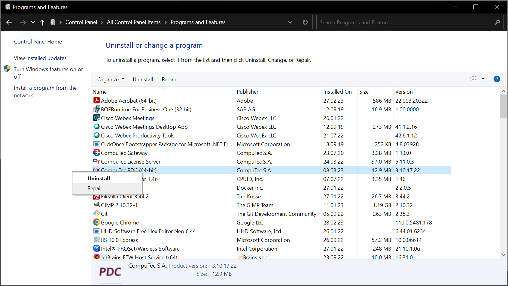

# Application upgrade

This document provides information on upgrading the PDC application to a newer version.

:::warning

As of the following releases: 3.10.6.1 (related ProcessForce version: 10.0 Release 6 (R6)), 3.93.15.1 (corresponding ProcessForce version: 9.3 PL14 Release 2 (R2)) CompuTec PDC is released as an AppEngine plugin only.

For the AppEngine plugin configuration manual, click **ADD LINK** here.

For the AppEngine plugin upgrade manual, click **ADD LINK** here.

:::

To upgrade CompuTec PDC to a newer version, perform the following steps:

1. Uninstall the CompuTec PDC application currently installed in a system.

   You can do it in Windows by choosing the following path: Control Panel > All Control Panel Items > Programs and Features. Right-click the CompuTec PDC (64-bit) line and select Uninstall.

   

2. Get the latest version of the CompuTec PDC installer file.

   You can find it **ADD LINK** here.

3. Perform the installation procedure described here using the new file.

   Please be sure to fulfill the requirements before starting installation.
