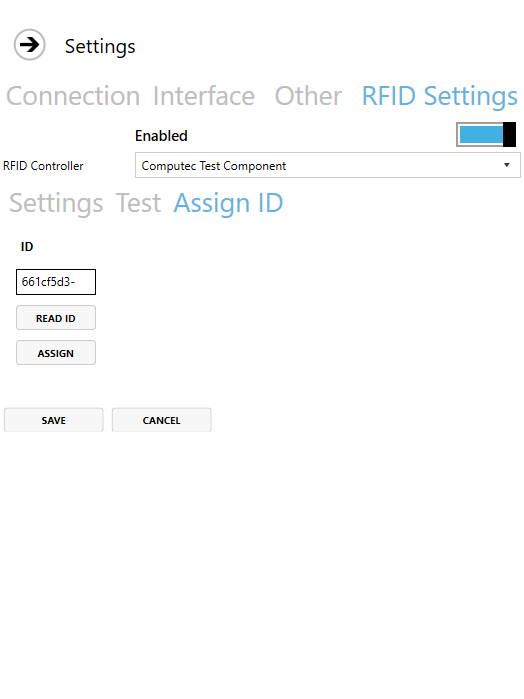
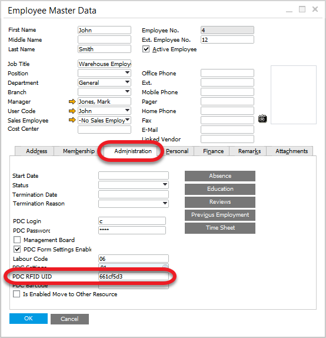

# PDC Settings

Here you can find information on PDC Settings: what details can be defined and how to assign a set of settings to a specific employee or CompuTec PDC installation.

---

## General Settings

You can define the settings to be taken from CompuTec PDC installation (assign just to it) or predefined settings templates (assign to a specific Employee) **ADD LINK** CompuTec PDC installation (assign just to it), or from predefined settings templates (assign to a particular Employee). The way of getting the settings can be set up in **ADD LINK** ProcessForce settings (PDC Way of Getting Settings field).

## PDC Settings templates

:::info Path
Administration → Setup → General → PDC Settings
:::

Here you can define and save a set of settings that can next be assigned to a specific Employee or a specific installation of CompuTec PDC. Go to the next section to check how to do this.

Most of the options are available either in **ADD LINK** ProcessForce or **ADD LINK** PDC-level level settings.

Options present only in the PDC Settings form:

- Resource Code – if this field is filled in, the user with these PDC Settings assigned can only see Tasks for a specified resource.

- Notification after login – text put in this box is displayed after logging in to the application in an additional form.

- Show Date Picker – this option allows to set amount of time in minutes (e.g., 67 minutes) instead of date and time on time registration:

  

- Localizations – weighting module-related option. Only devices from localizations listed here are available in Weighting Wizard (the weighting device, along with its localization, can be configured in CompuTec Gateway Manager). If this field is left empty, all of the devices are available.

- Resources view – click here to find out more.

- Delay of closing dialogs (s) – here, you can set the time (in seconds) of dialog windows being displayed.

## Assigning PDC Settings templates

A template can be assigned to a specific Employee.

:::info
Human Resources → Employee Master Data
:::

Click Choose from List icon to choose one of the predefined PDC Settings.

Click Assign, log in and choose an Employee you want to assign to the card. It can be used if the ID is not assigned to any Employee.

Click Save – a user is assigned to an RFID identifier and ready to use.

### Employee Master Data

Assigned ID is stored in SAP B1 Employee Master Data:

:::info
Human Resources → Employee Master Data
:::

If ID is known, assigning it to an Employee from the SAP B1 level is possible – by putting it in the PDC RFIF UID field.

## Usage

When the module is set up correctly, we can use an RFID identifier (e.g., card) to log in by putting it next to the RFID reader. It should be done on the logging-in screen. It causes logging in for a specific Employee without manually putting in login and password.

Putting the card again causes log out. Putting another Employee's RFID card when logged in causes re-log to another Employee.
