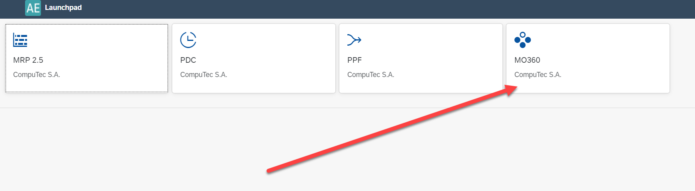
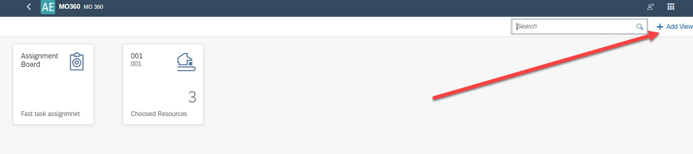
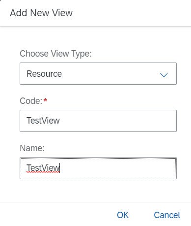
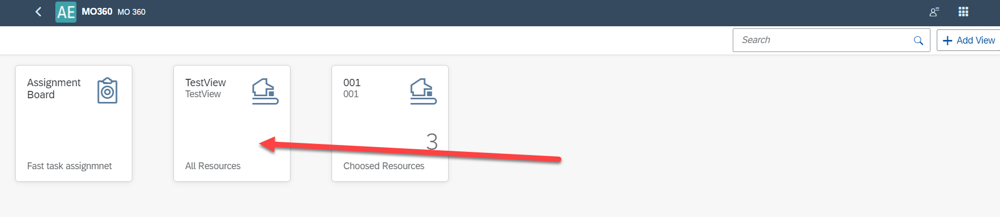
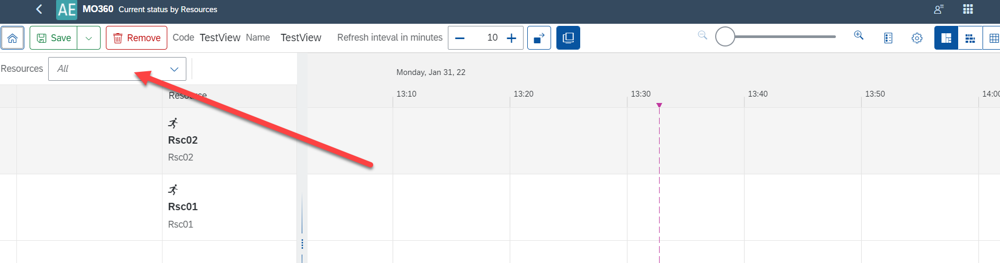

# Resources View

The purpose of this function is to filter tasks by multiple Resources.

---

## Requirements

The option requires the use of AppEngine's MO360 plugin. Click here for more information about AppEngine and AppEngine plugin installation.

Minimal related versions:

- ProcessForce: 9.30 PL14 R10 or 10.0 RL14,

- AppEngine: 2.10.3.1, 2.93.3.1 or 2.10.5.1, 2.93.5.1,

- MO360 - latest.

## Usage

Go to AppEngine, MO360 to define a view with multiple Resources:

Click Add View:

Define the view details:

Now the view is available in the main MO360 view:

Open the view and choose the All option for the Resources:

After defining this view, you can assign it in **ADD LINK** PDC Settings.
In this example, in CompuTec PDC, you can see only tasks for the following Resources: Rsc01, Rsc02, and Rsc03.