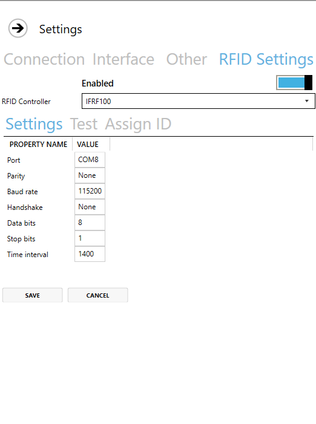
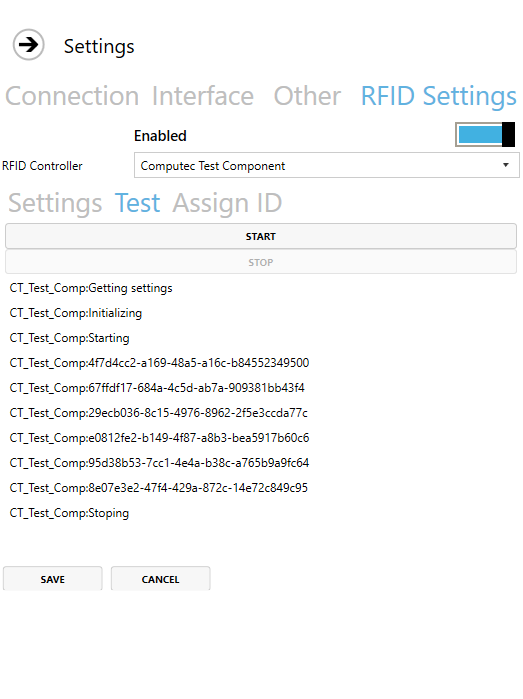

# RFID

Here you can check how to set up logging in by using RFID cards.

RFID is a way of using radio waves to send data that identifies a specific object. For example, the employee can log in or log out to a system or an application by putting a card with identification data on a dedicated reader.

It is possible to set up CompuTec PDC for using RFID identification to log in or log out of the application.5

---

## RFID Settings

### Settings

Enable – choose whether you want to use an RFID module or not.

RFID Controller – a list of defined controllers.

Time interval – a period after which a reader reads an identification. It is set up to 1400 (1,4 seconds) by default.

### Test

Here you can test if the chosen controller is set up correctly: after clicking Start, the controller tries to read identification every period set up in Settings > Time Interval. If the controller is set up correctly, there will be information on every identification read.

### Assign ID

Click Read ID and put the RFID card on the reader. The field will be filled up with data assigned to the RFID Card:

![]