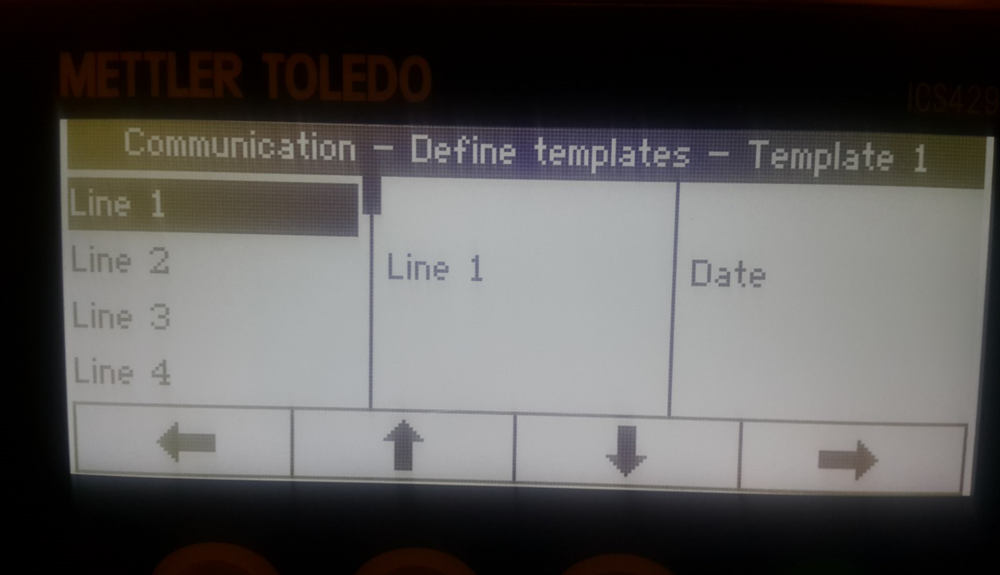
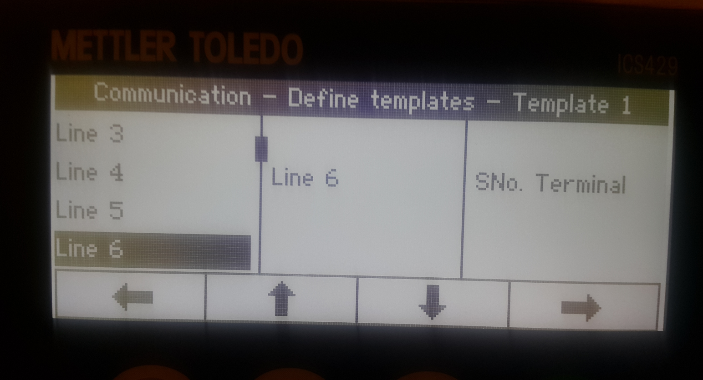
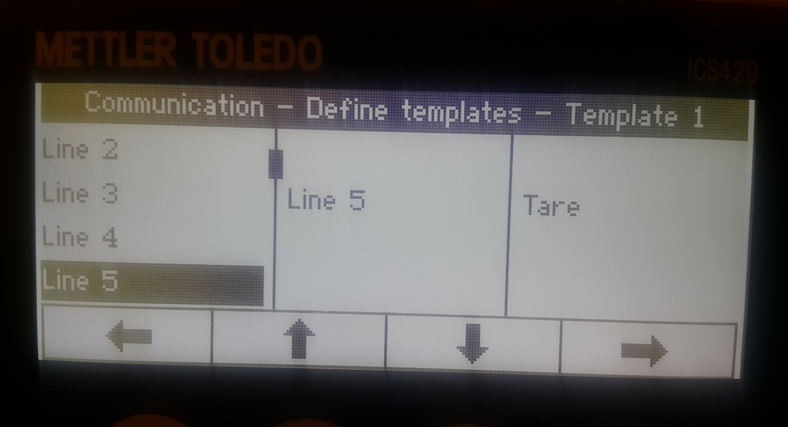
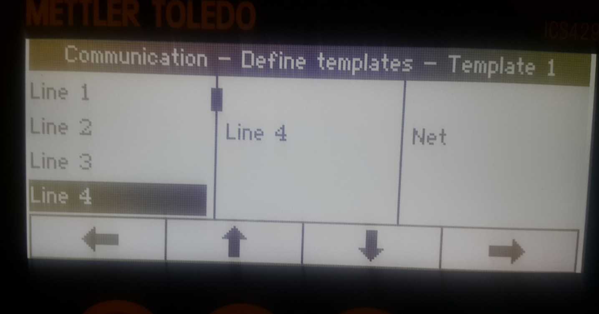
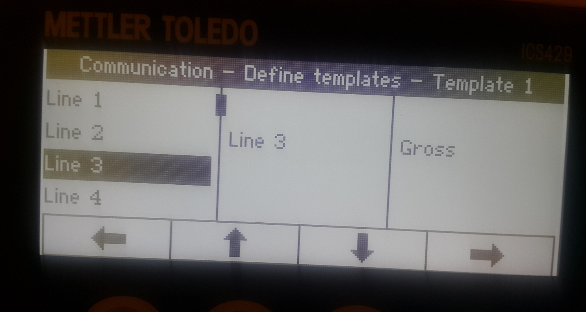
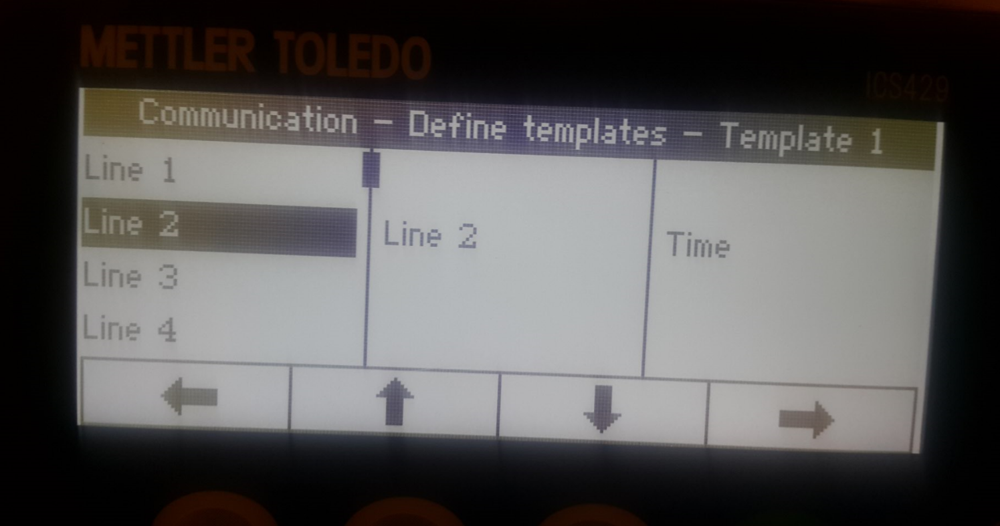
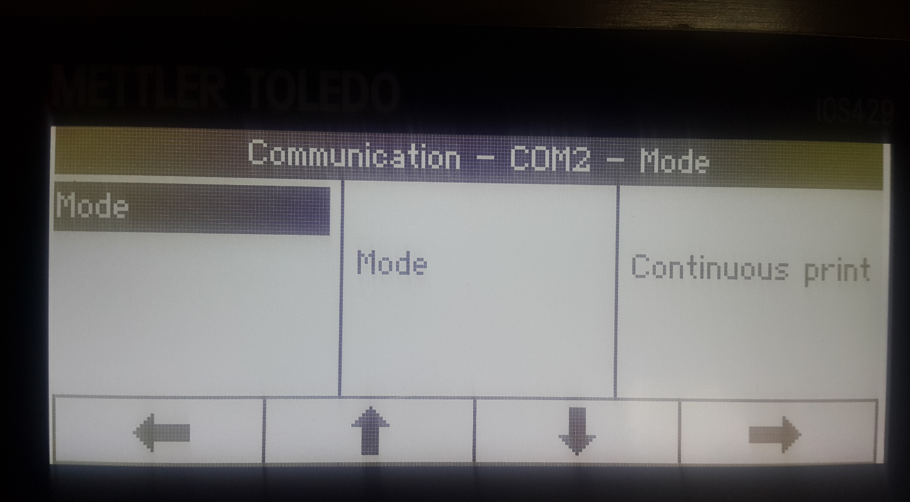
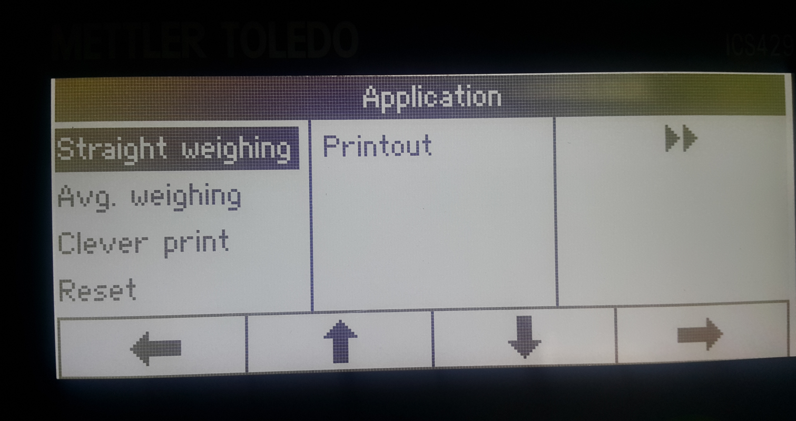
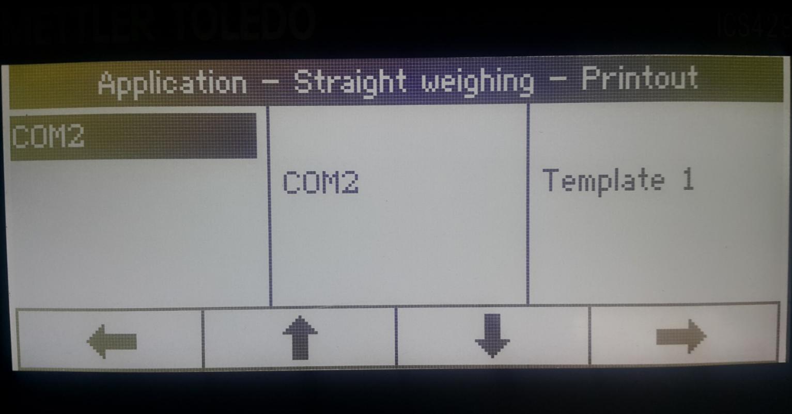
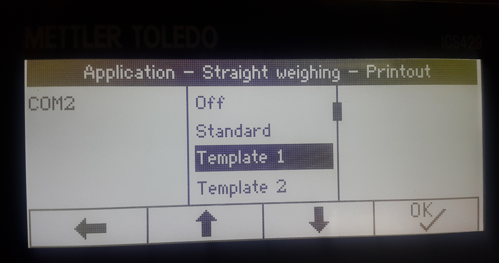

# Mettler Toledo

## Introduction

To correctly configure a weight scale, it is required to create a Template and assign it to the weight scale. Next, you must choose a work mode for the scales and assign the Template to the scale work mode.

Note: this section was created based on the MettlerToledoICS429 model configuration.

---

Defining a Template

- Go to the Communication option in the main menu.

- Choose the Define Template option.

- Choose Template 1 and set up what will be pointed/sent by the weight scale. Set up the following details:

    Line 1: Date

    Line 2: Time

    Line 3: Gross

    Line 4: Net

    Line 5: Tare

    Line 6: SNo. Terminal.

    

    

    

    

    

    

## Choosing Mode for Weight Scales

    - Go to the Communication option in the main menu

    - choose COM2
    
    - choose Mode
    
    - choose Continuous print.

## Assigning the defined Template to the weight scales

    - Choose the Application option from the menu
    
    - choose Straight weighing option
    
    - choose Printout
    
    - choose COM2
    
    - choose COM2 again
    
    - choose the Template name of the Template that was defined in the first step ('Template 1' in this example)
    
    -. click OK to save the changes.

  

  

  

  

  

## Set date and time format

Now, the weight scale is correctly configured and ready to work with CompuTec Gateway and CompuTec PDC.

