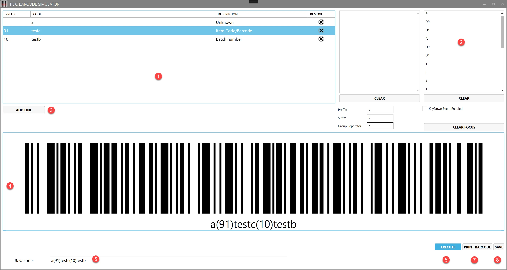
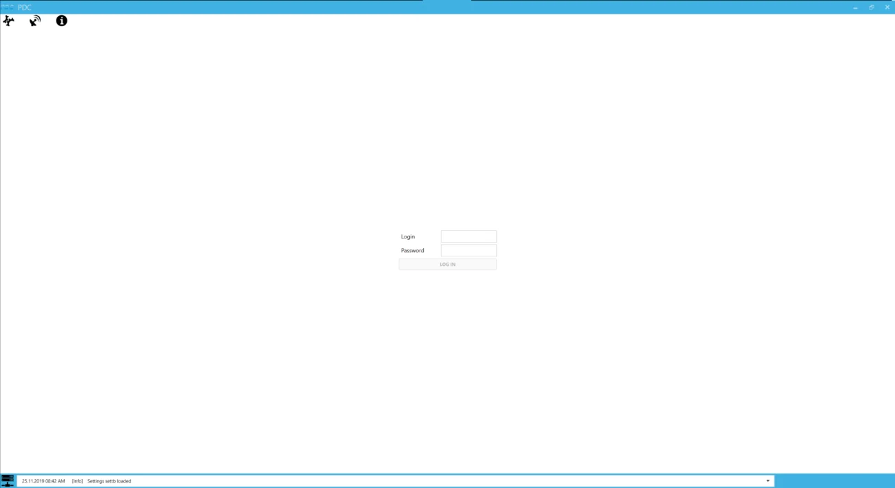
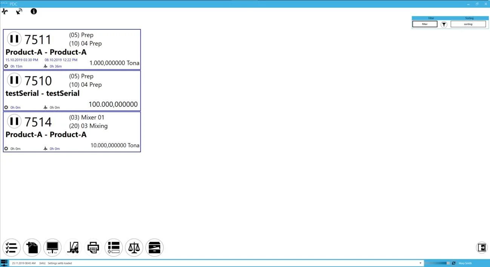
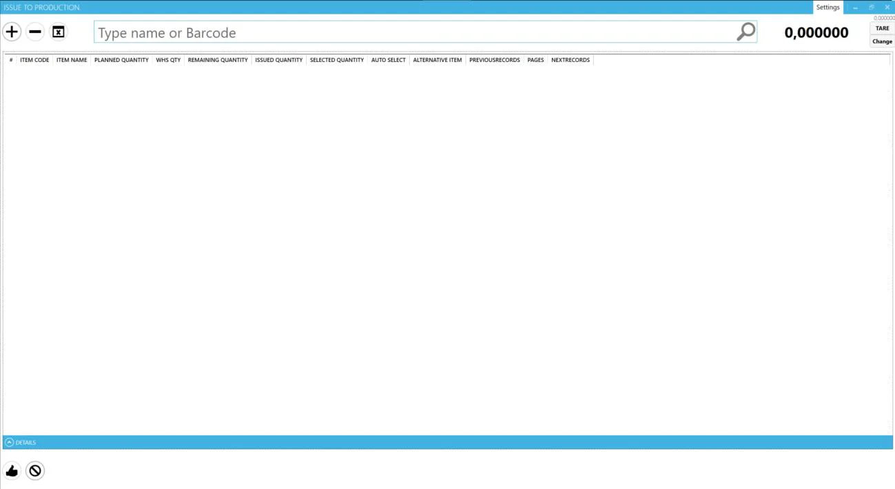
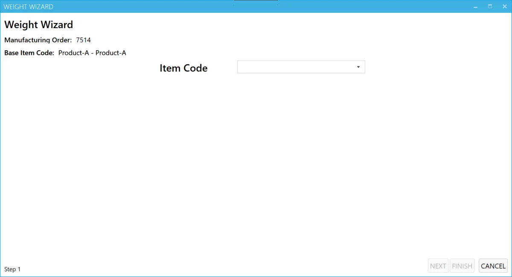
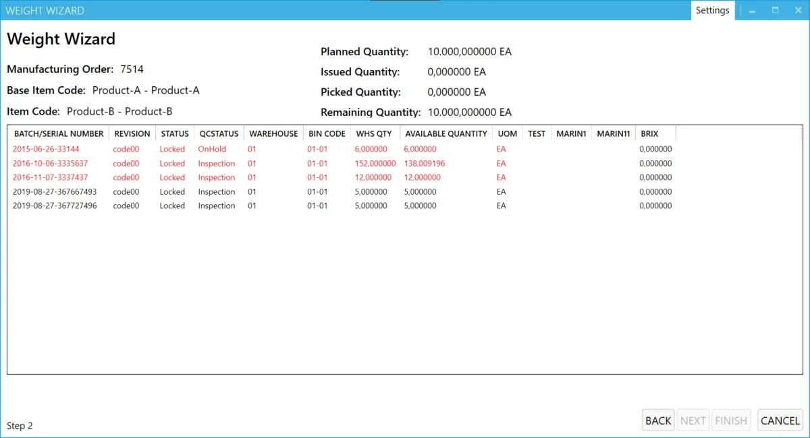

# Barcodes

Many of CompuTec PDC functions can be operated by scanning barcodes. Here you can find information on barcode scanning.

## General information

### Barcodes physical attributes

The minimal and maximal size of supported barcodes depends on scanner attributes.

CompuTec PDC supports every barcode standard as long as it is recognizable for a scanner used with the application.

### USB scanners

The CompuTec PDC client can be used with USB scanners. Here is a default configuration:

- scanning device adds a start text sign (Ctrl + B),
- scanning device adds an end text sign (Ctrl + C).

You can set up custom prefixes, suffixes, and group separators here.

## Barcode simulator

PDC Barcode Simulator was created to:

- create barcodes based on the input information,
- print created barcodes,
- simulate barcode scanning in CompuTec PDC (for testing purposes).

Click to download Barcode Simulator.<!--TODO: Link -->

1. A list of elements in a barcode (two prefixes in this example). If you want to generate a barcode without a prefix, leave the Prefix column empty.
2. A list of all input signs:

    - \[STX\] means – CTRL+B
    - \[ETX\] means – CTRL+C
    - \[GroupSeparator\] – a code blocks separator (for codes with more than one prefix)
3. Adding line (for multi-prefix codes).
4. A graphic form of the code generated based on input data.
5. A text form of the code generated based on input data.
6. Click this button to simulate executing the code in CompuTec PDC.
7. Print the generated barcode.
8. Click here to save the code as a file in .webp format.

In PDC Barcode Simulator, you can scan a ready barcode to check its validity and elements (in case it is a multi-prefix code) or to check if the scanning device works correctly.

Check the information in the next section to get to know how to create barcodes for CompuTec PDC and where in the application to use it.

## Barcodes usage in CompuTec PDC

### Logging in form

Available barcodes:

- Employee code – employee logging in (OHEM table, U_PDC_BARCODE field)
    

        
Click to check an example code

        <table>
            <thead>
                <tr>
                    <th>Barcode</th>
                    <th rowspan="2">Represents</th>
                </tr>
                <tr>
                    <th>Employee code (OHEM → U_PDC_BARCODE)</th>
                </tr>
            </thead>
            <tbody>
                <tr>
                    <td>1234</td>
                    <td>Employee with code 1234</td>
                </tr>
            </tbody>
        </table>
    

- (99)employee_code – the same as the previous one with the 99 prefixes.

### The Main Form

Available barcodes:

- (99)employee_code – Employee code with 99 prefixes, logging out or logging to another Employee (the OHEM poleU_PDC_BARCODE table),
- A000 - open-close tasks dialog,
- Y000 – pauses all of the Tasks,
- Y111 – run all of the Tasks,
- Y222 – sets up all of the Tasks,
- Z000 – changes the status of the selected task to setup,
- Z111 – changes the status of the selected task to run,
- Z222 – changes the status of the selected task to Downtime,
- T000 – starts the Time Booking process for the chosen Task,
- (99)A000 - open-close tasks dialog,
- (99)Y000 – pauses all of the Tasks,
- (99)Y111 – changes status for all of the Tasks to run,
- (99)Y222 – sets up all of the Tasks,
- (99)A000(98)resource_code - open-close tasks dialog on Resource,
- (99)Y000(98)resource_code – pauses all of the Tasks on Resource,
- (99)Y111(98)resource_code – changes the status of all of the Tasks to run on a Resource,
- (99)Y222(98)resource_code – sets up all of the Tasks on resource,
- (99)Z000 – changes the status of the selected Task to Setup,
- (99)Z111 – changes the status of the selected Task to Run,
- (99)Z222 – changes the status of the selected Task to Downtime,
- (99)T000 – starts the Time Booking process,
- Sign code (a Task code) – choosing a Task (@CT_PF_OTRT table, Code field),
    

        
Click to check an example code

        <table>
            <thead>
                <tr>
                    <th rowspan="2"></th>
                    <th>Barcode</th>
                    <th rowspan="2">Represents</th>
                </tr>
                <tr>
                    <th>Tile code (@CT_PF_OTRT→ Code)</th>
                </tr>
            </thead>
            <tbody>
                <tr>
                    <td>SQL Example</td>
                    <td>00000000000000000000000000001H</td>
                    <td>Tile with code 00000000000000000000000000001H</td>
                </tr>
                <tr>
                    <td>HANA Example</td>
                    <td>0000000001H</td>
                    <td>Tile with code 0000000001H</td>
                </tr>
            </tbody>
        </table>
    

- 22-sign code (Manufacturing Order DocEntry and line number, @CT_PF_MOR16 table, fields: DocEntry, U_LineNum) – adding a Task, DocEntry, and a line number are completed with 0s to keep a fixed number length,
    

        
Click to check an example code

        <table>
            <thead>
                <tr>
                    <th colspan="2">Barcode</th>
                    <th rowspan="2">Represents</th>
                </tr>
                <tr>
                    <th>Manufacturing Order Document Doc Entry(11 characters)</th>
                    <th>Line number (11 characters)</th>
                </tr>
            </thead>
            <tbody>
                <tr>
                    <td>00000001234</td>
                    <td>00000000005</td>
                    <td rowspan="2">MOR doc entry 1234 and line number 5</td>
                </tr>
                <tr>
                    <td colspan="2">0000000123400000000005</td>
                </tr>
            </tbody>
        </table>
    

- (96)task_code (@CT_PF_OTRT table, Code field) – choosing a Task,
- (253)manufacturing_order_number(97)operation_code(98)resource_code (respectively: @CT_PF_OMOR table DocNum field; @CT_PF_MOR16 table, fields: U_OprCode and U_RscCode) – adding a new Task; operation and resource codes are optional (if not in a barcode, then they have to be chosen manually).

## The Issue to Production form

Available barcode:

- (91)Item_code(99)item_sequence(10)batch_code(92)bin_code(95)quantity – Sequence, Batch, Bin Location, and Quantity are optional – if you do not add them, you will have to add them manually.

## Weight Wizard form

### Item choosing level

Available barcodes:

- item_code – choose an Item from the list,
- (91)item_code(99)item_sequence(10)batch_code) – choose Item and Batch (Sequence and Batch field are optional).

### Batch choosing level

Available barcodes:

- batch_code – chooses a Batch from the list,
- (10)batch_code – chooses a Batch from the list.
