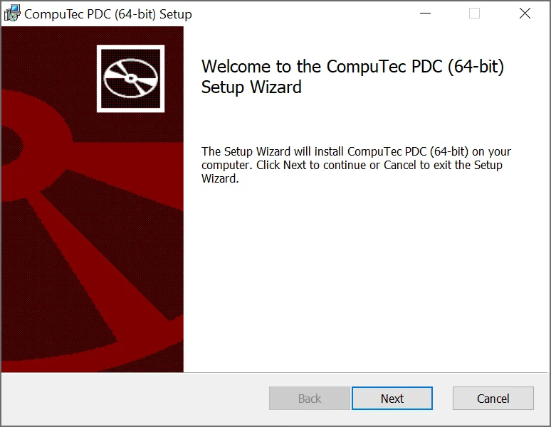
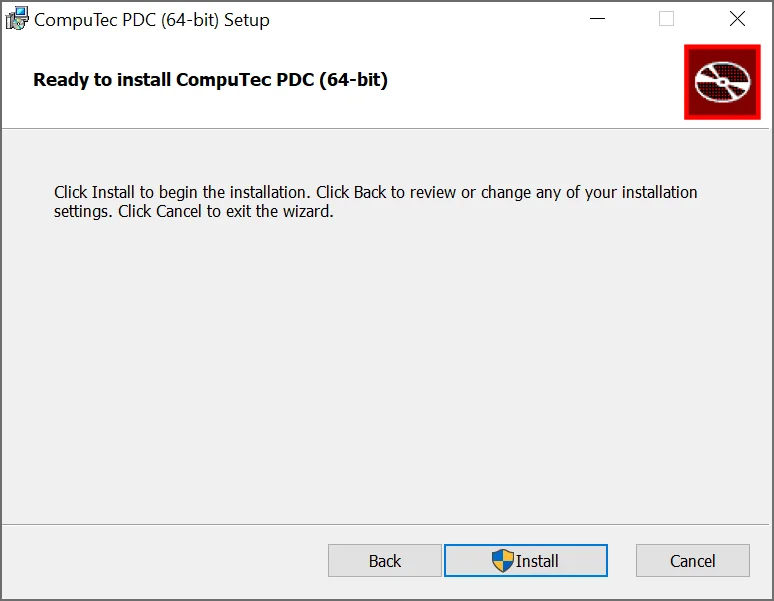
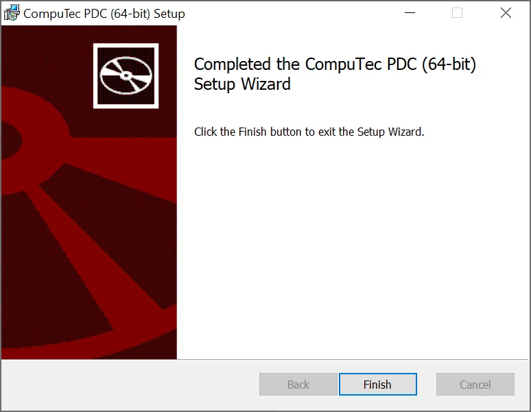

# First installation

This document provides a step-by-step guide on how to install the CompuTec PDC application. If you are looking for information on how to upgrade the application, click [here](./application-upgrade.md).

:::warning
    As of the following releases: **3.10.6.1** (related ProcessForce version: 10.0 Release 6 (R6)), **3.93.15.1** (corresponding ProcessForce version: 9.3 PL14 Release 2 (R2)) **CompuTec PDC is released as an AppEngine plugin only**.
:::

:::warning
    Be sure to fulfill the requirements described [here](./requirements.md) before starting an installation process.
:::

1. To install the CompuTec PDC application, download and run its installation file <!-- TODO: Link --> – CompuTec.PDC.Setup.x64.msi.
2. In the window that appears, click the "Next" button after reading the message about installation preparation.

    
3. A window with a path of an installation destination will appear.
  
    A default path is "C:\Program Files\CompuTec\PDC3\". You can change the path by typing in a new one or browsing existing folders by clicking the "Change..." button.  
  
    Click the "Next" button.  
  
    
4. A new window appears. Click the "Install" button to start the installation.
  
    
5. Click the "Finish" button after reading the message to finish the installation.
  
    
6. The service is ready to run. You can start by clicking the shortcut created on the Windows program list.

:::info
    Remember that the application needs to be set up correctly after the installation.
:::
