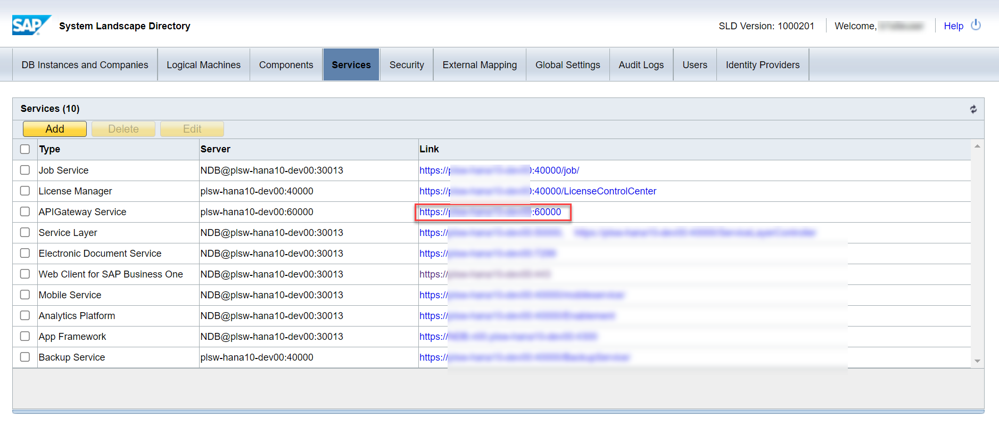
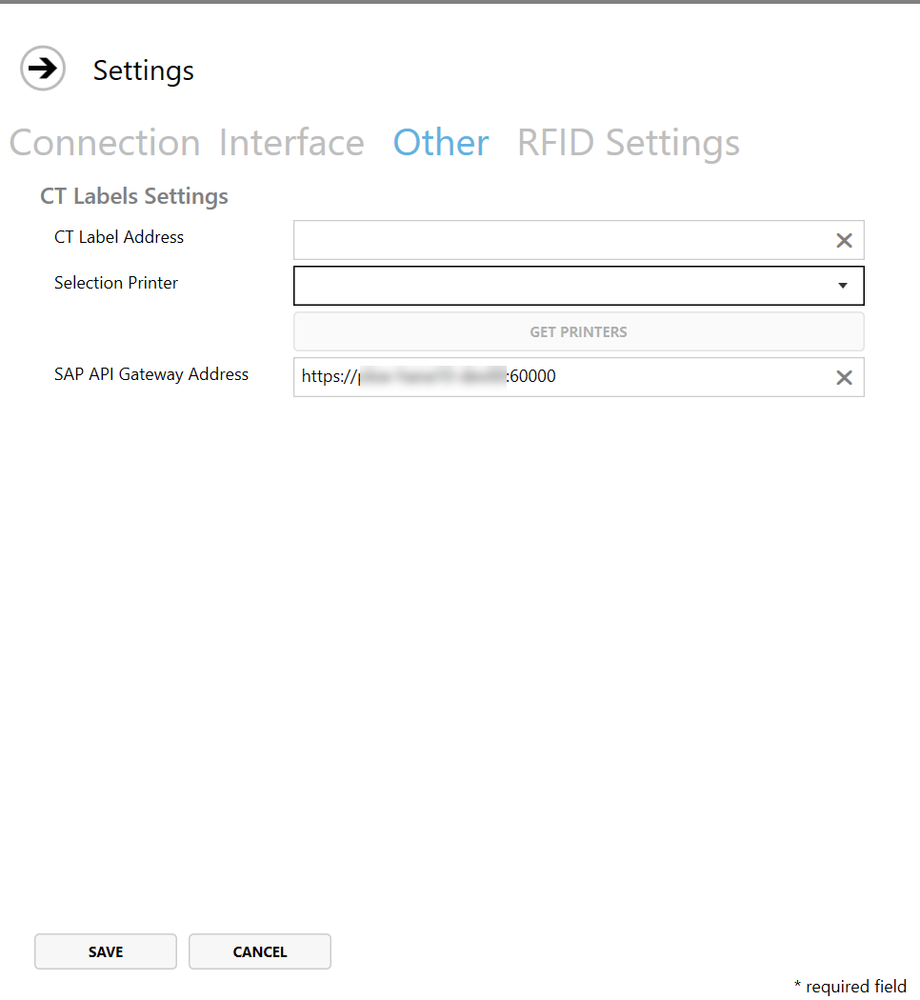

# Requirements

:::note
CompuTec PDC requires .NET Framework to work correctly. The minimum version of the .NET Framework supported by CompuTec PDC is 4.7.1.
<details>
  <summary>Click to see how to check .NET Framework version</summary>

  1. Type in the following command in Command Prompt from Windows applications:

  ```reg query "HKEY_LOCAL_MACHINE\SOFTWARE\Microsoft\NET Framework Setup\NDP\v4\full" /v version```
  
  

  And click enter.
  2. The result will show the .NET Framework version:

  

  We recommend installing the latest version of .NET Framework – you can do it using the dedicated tool Windows Update or manually downloading the required files from the Microsoft site.

</details>

## Steps required to perform before installation of CompuTec PDC

1. Install AppEngine, the CompuTec ProcessForce plugin, and the CompuTec PDC plugin in corresponding versions.

2. Install SAP Crystal Reports runtime engine for .NET Framework 32-bit or 64-bit. You can install it from SAP Business One installation package -> Client\CRRuntime or Client.x64\CRRuntime. It is required if the user wants to open Crystal Reports directly from the application.

3. Install CompuTec ProcessForce API 32-bit or 64-bit.

## 2.10.20.1: Crystal Reports

From this version, CompuTec PDC supports the new Crystal Reports mechanism. You can find more information here.

Since this version, you need to perform the following preparation to support Crystal Reports:

- Installed SAP APIGateway Service in SLD configuration:

  

- define an address in CompuTec PDC Settings.

  

## CompuTec Labels

If you use CompuTec Labels along with CompuTec PDC, there is a need to have a connection between the CompuTec PDC terminal and a server where CompuTec Labels are installed.