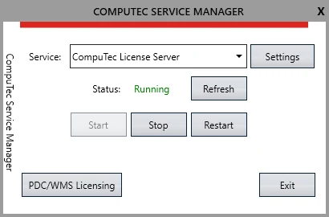
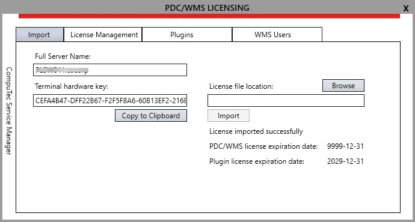
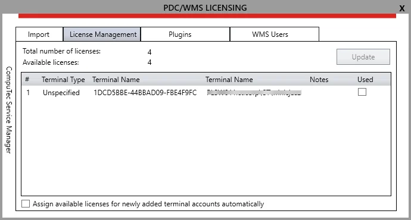
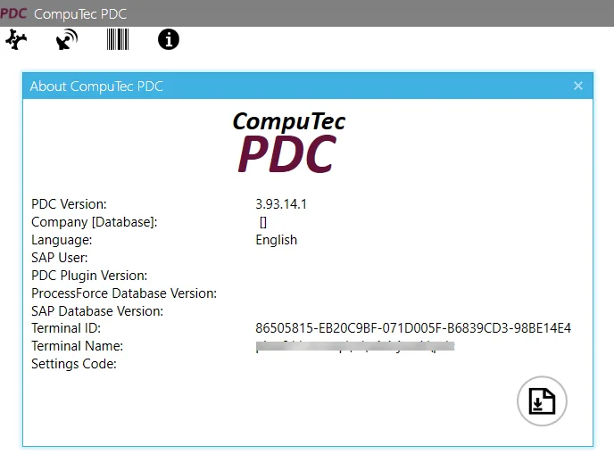

# Overview

**This document provides information on licensing the application, which is needed for its legal use.**

:::caution
    A terminal on which CompuTec PDC is installed requires a connection to a server on which CompuTec License Server is Installed.
:::

1. Start CompuTec Service Manager by clicking on its shortcut created in the Windows program list. An icon will appear in a tray. Click it to open the application.

    :::info
        CompuTec Service Manager is a tool available with CompuTec License Server. You can download its latest version from the current ProcessForce Downloads page.
    :::
2. CompuTec License Server service is running by default after installing CompuTec License Server. If not – choose it from a drop-down list and click the Start button:

    
3. Click PDC/WMS Licensing button to open the window where you can set details of CompuTec PDC licensing.
4. To obtain a license file, the following information must be sent to CompuTec support (as described in [the CompuTec PDC license request page](./pdc-license-request.md)):

    - Full Server Name – it is displayed automatically in a field marked on the screenshot below after the successful installation of the application. It indicates a specific machine that the application is installed on.
    - Terminal License Key – the value generated automatically based on the internal system information.

        
5. In License file location: field type in or browse the path to the license file received from CompuTec support.
6. Click the Import button to load a license from the file.
7. One of the two communication will appear:

    - License imported successfully – license is loaded from an appropriate file,
    - License is not invalid – invalid license file loaded.
8. After receiving the "License imported successfully" communication, information about the number of days of license validity left is displayed.
9. Run CompuTec PDC and try to log in to it. You can check how to install, run it and log in here. Not Connected No License Assigned communication will be displayed.
10. Reload PDC/WMS LICENSING window. After that, a new Terminal will be displayed on the License Management tab:

    
11. Two values are communicated on this tab:

    - Total number of licenses – number of licenses loaded from a file,
    - Available licenses – number of licenses not assigned to any terminals.
12. Choose a desired terminal from the list, check the checkbox to assign a license, and click update. Note that the Number of Available Licenses decreases after that because of starting to use one of them.

    
13. A license is now assigned to a terminal that can work with it.
14. Terminal ID can be read in the About CompuTec PDC window, which is available under an information icon on the logging panel:

    
