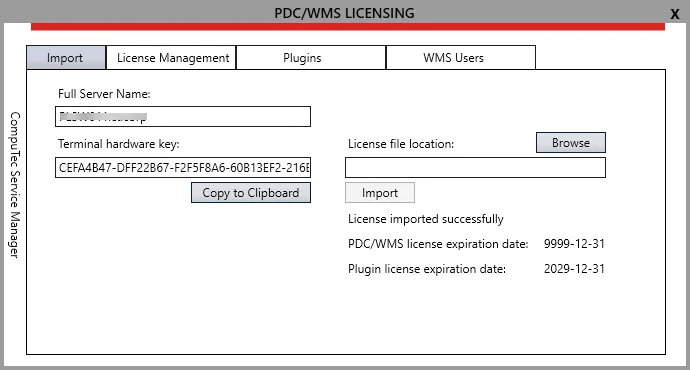

# CompuTec PDC license request

To obtain a license file, please create a support ticket via support.computec.pl (Type: Information, Component: License request) and provide the following information:

## License type

The destined environment:

- a customer server,
- a partner internal server

and the license purpose:

- an official purchase,
- a demo/test license.

:::info
    By default, we generate CompuTec PDC/WMS demo/test licenses for 2 Terminals/Users.
:::

## System information

The information needed for generating the license located on PDC/WMS LICENSING window, Import tab:

:::info Location
    CompuTec Service Manager application → PDC/WMS Licensing button
:::

- **Full Server Name**
- **Terminal License Key** (5 blocks of 8 characters, separated by a dash sign)

:::caution
    Please use the Copy to Clipboard button and paste the information into the support ticket.
:::

