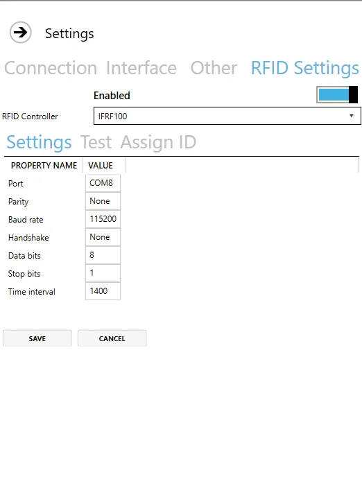
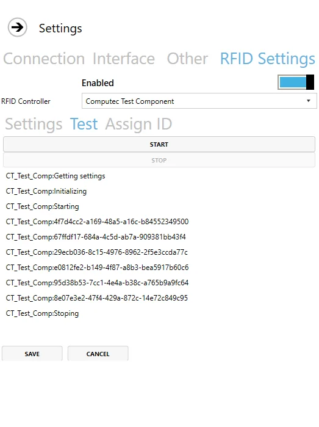
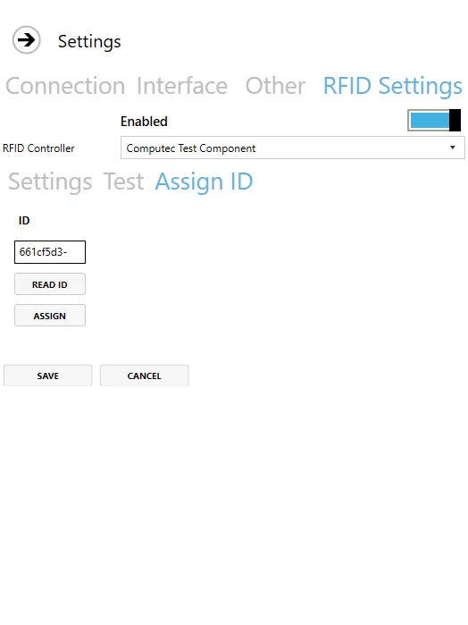
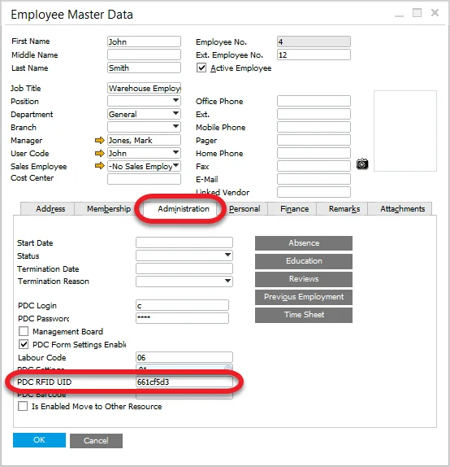

# RFID

Here you can check how to set up logging in by using RFID cards.

RFID is a way of using radio waves to send data that identifies a specific object. For example, the employee can log in or log out to a system or an application by putting a card with identification data on a dedicated reader.

It is possible to set up CompuTec PDC for using RFID identification to log in or log out of the application.

---

## RFID Settings

### Settings

Enable – choose whether you want to use an RFID module or not.

RFID Controller – a list of defined controllers.

Time interval – a period after which a reader reads an identification. It is set up to 1400 (1,4 seconds) by default.

### Test

Here you can test if the chosen controller is set up correctly: after clicking Start, the controller tries to read identification every period set up in Settings > Time Interval. If the controller is set up correctly, there will be information on every identification read.

### Assign ID

Click Read ID and put the RFID card on the reader. The field will be filled up with data assigned to the RFID Card:

Click Assign, log in and choose an Employee you want to assign to the card. It can be used if the ID is not assigned to any Employee.

Click Save – a user is assigned to an RFID identifier and ready to use.

### Employee Master Data

Assigned ID is stored in SAP B1 Employee Master Data:

:::info Path
    Human Resources → Employee Master Data
:::

If ID is known, assigning it to an Employee from the SAP B1 level is possible – by putting it in the PDC RFIF UID field.

## Usage

When the module is set up correctly, we can use an RFID identifier (e.g., card) to log in by putting it next to the RFID reader. It should be done on the logging-in screen. It causes logging in for a specific Employee without manually putting in login and password.

Putting the card again causes log out. Putting another Employee's RFID card when logged in causes re-log to another Employee.
