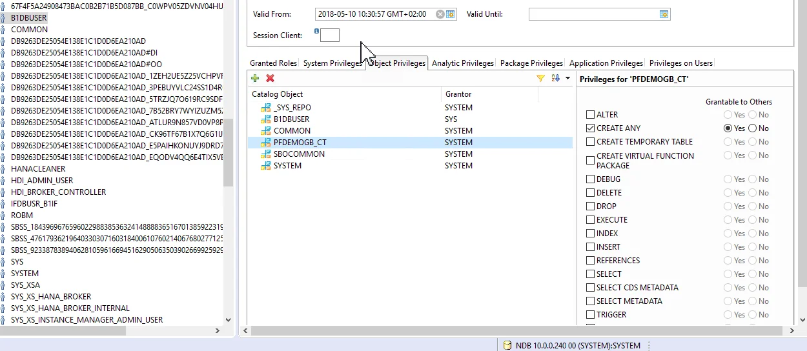
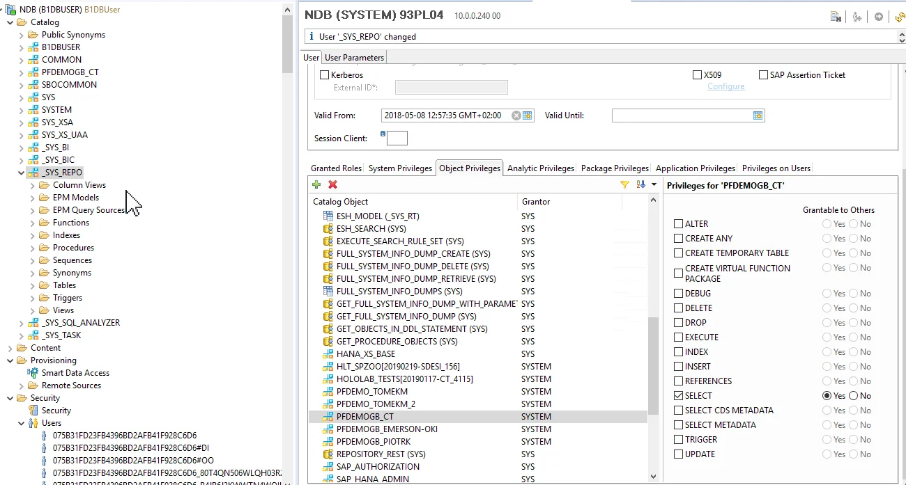

# SAP HANA user other than SYSTEM

In some cases, a customer would like to use a HANA database user other than SYSTEM, e.g., to avoid giving employees access to all related privileges (as the SYSTEM user has all the privileges needed to set up, manage and update in the system). Here you can find requirements for setting up another user in the system that can be used to operate on Crystal reports through CompuTec PDC.

---

The following requirements are described in [SAP Business One note no. 2302616 - Validation - SAP HANA database user privileges](https://connect.computec.pl/download/attachments/233506987/2302616_E_20190607.pdf?version=1&modificationDate=1649077528287&api=v2) have to be met:

```text
Roles:

    PUBLIC
    CONTENT_ADMIN
    AFLPM_CREATOR_ERASER_EXECUTE

System privileges:

    CREATE SCHEMA (grantable)
    USER ADMIN (grantable)
    ROLE ADMIN (grantable)
    CATALOG READ (grantable)
    IMPORT
    EXPORT
    INIFILE ADMIN
    LOG ADMIN
    This is needed if this database user is used to run the migration wizard to migrate your company databases from the Microsoft SQL Server to the SAP HANA server.


SQL object privileges:

    SYSTEM schema: CREATE ANY, SELECT
    _SYS_REPO schema: SELECT, EXECUTE, DELETE (all grantable)


The SBOCOMMON schema is created during the installation of the SAP Business One Server, and the COMMON schema is created during the installation of the analytics platform. If you use different SAP HANA users for installing various components, you must pay special attention to granting the following object privileges as appropriate:

    SBOCOMMON schema: SELECT, INSERT, DELETE, UPDATE, EXECUTE (all grantable)
    COMMON schema: SELECT, INSERT, DELETE, UPDATE, EXECUTE (all grantable)
```

Additionally, the required schema has to be added to the user with the following privileges (in the following example user is B1DBUSER, and the required scheme is PFDEMOGB_CT):




