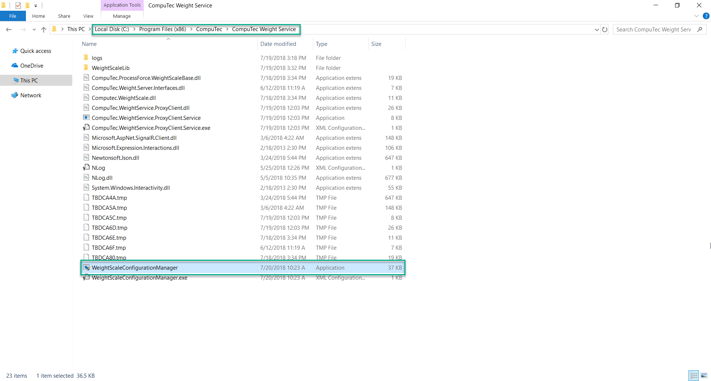
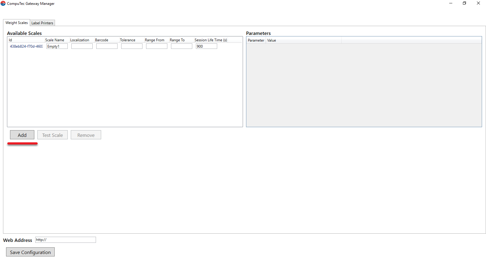
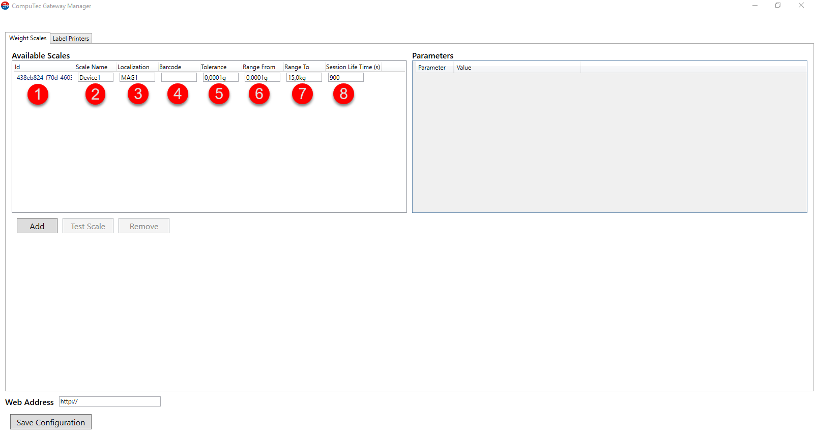
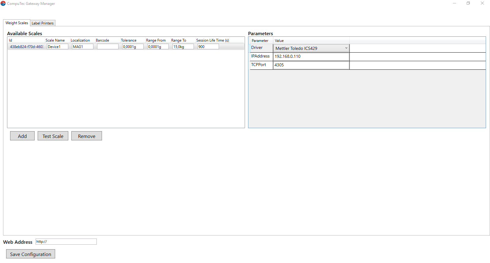
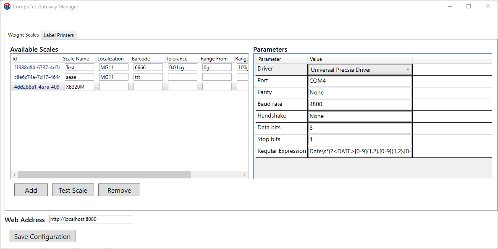
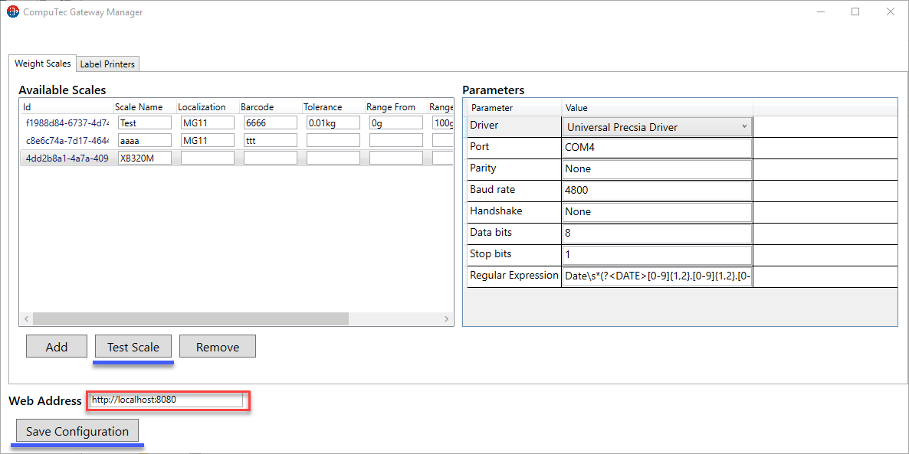
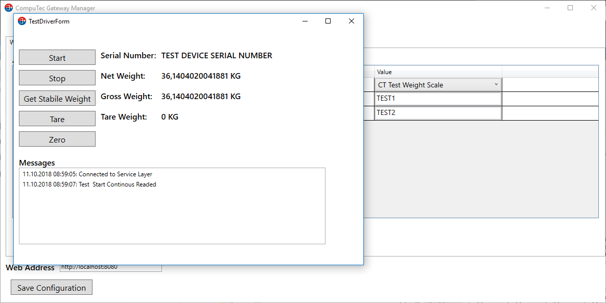

# CompuTec Gateway Manager

Here you can find a step-by-step guide on how to configure CompuTec WeightScale manager.

---

## Prerequisites

- Configure your firewall to make the 8080 port available.

- Net Framework 4.7 is required.

## Installation

1. The application is installed automatically during CompuTec Gateway Service installation.

2. Go to the WeightScale configuration manager installation folder and run the file WeightScaleConfigurationManager. 

    It is located in an installation folder, which is by default in the following location: C:\Program Files (x86)\CompuTec\CompuTec Weight Service\.

    

3. Click Add to add a new weighting device with a unique identifier.

  

4. Available Scales tab columns:

- Id – a unique identifier of the scale (automatically generated)

- Scale name – the name of the weighting device (e.g. manufacturer)

- Localization – location of the device (check a related PDC Settings option)

- Barcode – a barcode or a serial number of the device

- Tolerance – weight tolerance

- Range From – weighing range (start)

- Range To – weighing range (end)

- Session Life Time – inactive session time (seconds)

  

5. Once you click the scales identifier, the setup window opens in the Parameters tab.

  

6. Expand the driver tab to select an available device. There are two possibilities to connect the weight scale:

    a. TCP/IP – enter the IP address and port of the scale (the default port number is 4305).

    

    b. RS232 – you can change COM port, parity, baud rate, handshake, data bits, stop bits, and regular expression.

    

7. Now you can save the configuration and perform a test of the printer. Remember to put the Web Address. (It is required to put the IP address or a machine name of the server where Service Layer is installed). The default port is 8080. You can change the port number if needed.

  How to change port:

  The port can be changed by editing a file located in CompuTec Service Layer installation folder. The default path: C:\Program Files\CompuTec\CompuTec Service Layer\CompuTec.ServiceLayer.Host.WindowsService.exe

  

  The port set in Settings, Other tab has to be the same as here.

  

  
