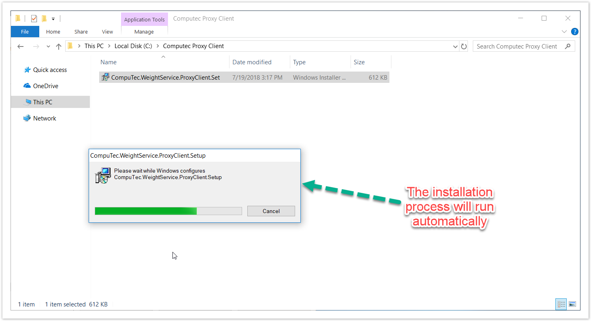
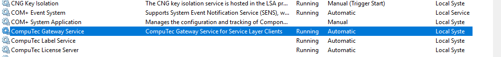

# CompuTec Gateway Service Installation

This document provides a step-by-step guide on how to install the CompuTec Gateway service.

---

## Prerequisites

- configure your firewall to make the 8080 port available.

- .Net Framework 4.7.1 is required.

## Installation

1. To install CompuTec Gateway Service, download and run its installation file. You can find it: 1.2.0.14 version: Download.

2. Once the installation is complete, the Gateway Service service will start automatically.

3. The CompuTec Gateway Service is successfully started and connected to the Service Layer.

  

4. Now you can go to the Weight Configuration Manager.
