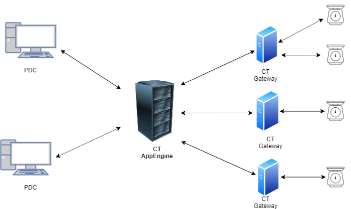

# Overview

In this section, you can check how to configure a connection between CompuTec PDC and weighing devices.

---

## Weight scales connection architecture

## Configuration steps

1. [Service Layer (CT AppEngine) installation](./service-layer-installation.md)
2. [CompuTec Gateway Service Installation](./gateway-service-installation.md)
3. [CompuTec Gateway Manager](./computec-gateway-manager.md)
4. [Example weighing devices configuration](./example-scale-configuration/mettler-toledo.md)
5. [Working with scales](./working-with-scales.md)
