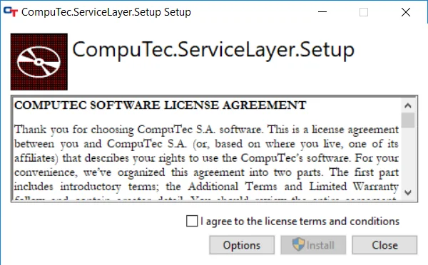
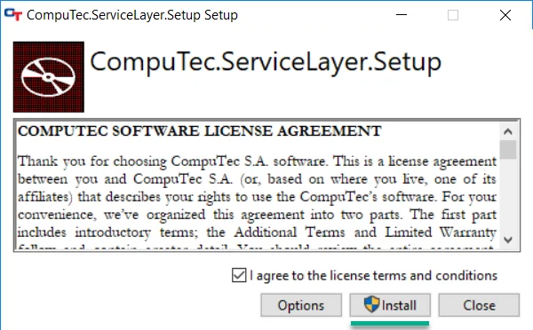
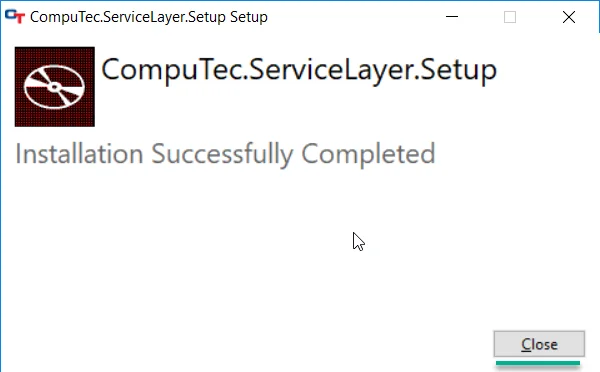
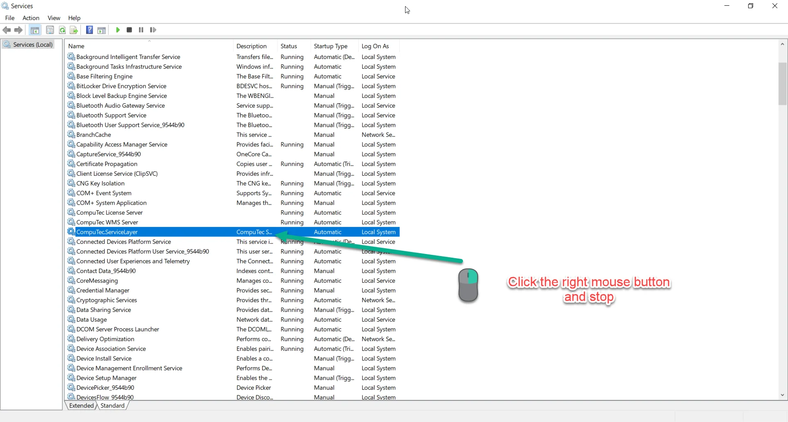
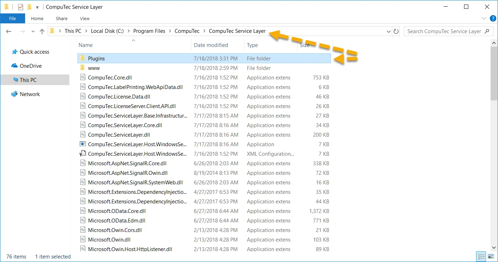

# Service Layer (CT AppEngine) installation

This document provides a step-by-step guide on how to install the CompuTec Service Layer client.

---

## Prerequisities

- configure your firewall to make the 8080 port available
- .Net Framework 4.7 is required

## Installation

1. To install the Computec Service Layer client download and run its installation file – you can find it here<!-- TODO: Link -->.
2. Check the checkbox after reading the message about installation preparation:

    
3. Click the Install button to start the installation. A default installation path is "C:\Program Files\CompuTec\CompuTec Service Layer\".

    
4. Click the Close button after reading the message to finish installation:

    
5. When the installation is complete, go to the system services and find CompuTec.ServiceLayer service. If it is enabled then turn it off.

    
6. Go to the CompuTec Service Layer installation folder and paste the Plugins directory that you can find here<!-- TODO: Link -->:

    
7. Turn CompuTec.ServiceLayer service on.
8. Service is ready to run. You can start it by clicking the shortcut created in the Windows program list.
9. Next, go to the [CompuTec Gateway Service Installation](./gateway-service-installation.md) section.
