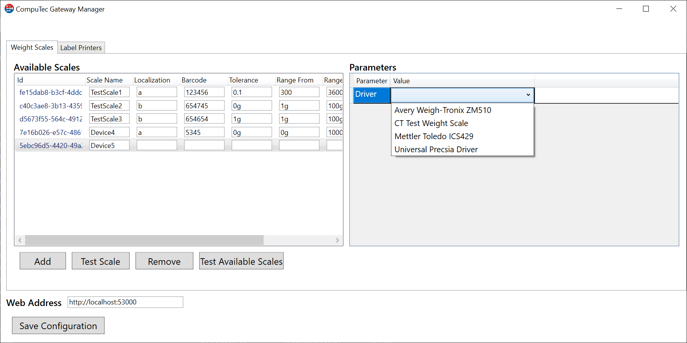
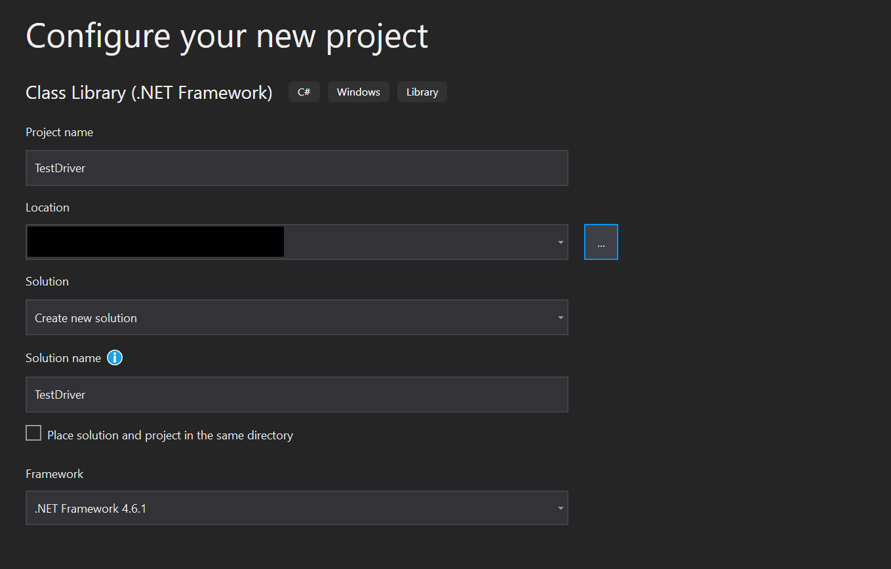
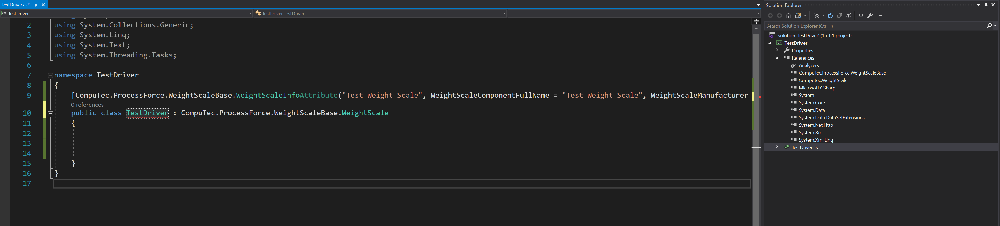
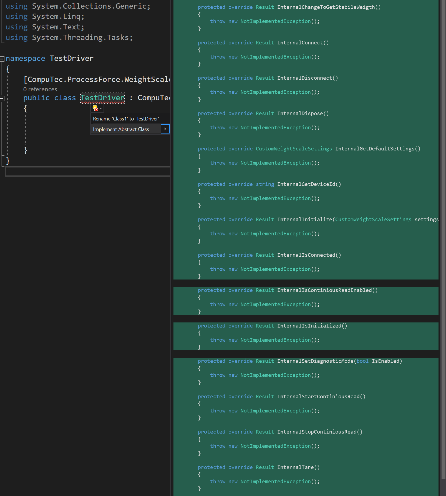

# Weighting device drivers

Here, you can find information on weighting device drivers: the ones available by default and tips on creating your own.

---

## Currently supported devices:

Precisa:

    XB320M
    480S/BK1200D
    XB120A

Mettler Toledo:

    ICS429

Avery Weigh-Tronix

    ZM510

The devices are available to choose from the CompuTec Gateway Manager:

'CT Test Weight Scale' is a test driver that generates random weighting data for test purposes.

Custom driver creation and usage

It is possible to create your driver for a device not listed in the available devices list from the previous point.

:::note

If a required device is not on the list in the previous paragraph and you are unwilling or unable to create a driver, the CompuTec team can do it for you for a fee. To order such a service, please create a support ticket at https://support.computec.pl.

:::

## A driver creation

The following example is created using Microsoft Visual Studio.

1. Create a project:

  

2. Add dependencies to the provided libraries:

  Computec.WeightScale.dll

  CompuTec.ProcessForce.WeightScaleBase.dll

3. Prepare a class of the drive:

  

4. Implement the methods and update them in accordance with the device requirements:

  

  You can check the class in the example driver (CT Test Weight Scale). You can download it from here: [here](./media/TestDevice.cs).

## Usage

Once the driver is created, place it in the following directory (this is the default installation directory):

Now, the driver should be available in the list in CompuTec Gateway Manager (please check the top screenshot on this page).
