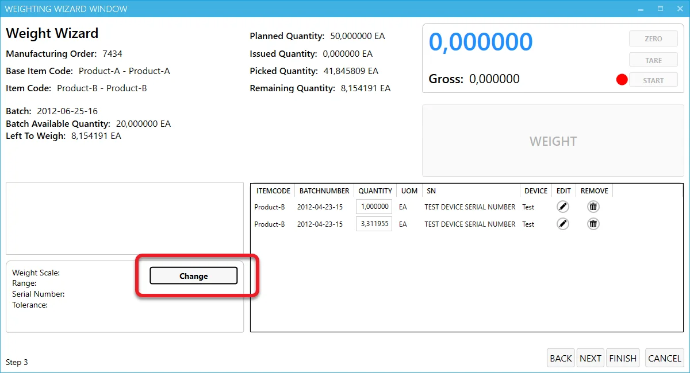

# Working with scales

After the successful configuration the configured devices will be available to choose from and use in Weight Scale module in CompuTec PDC:

Click [here](../../user-guide/customization/optional-functions/weight-scale-module/overview.md) to get more information on how to use the CompuTec PDC weighting module.
