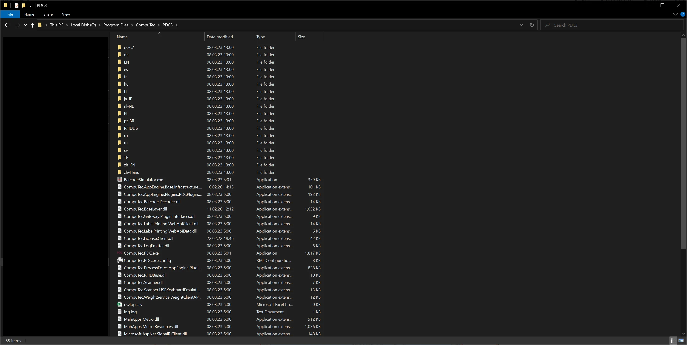

# FAQ

The frequently Asked Questions section helps deal with minor problems while operating CompuTec PDC.

---

Many exceptions thrown by CompuTec PDC are caused by incorrect installation or configuration. Please check the following page first: CompuTec PDC Plugin <!-- TODO: Link -->.

Here you can also find a solution for the following issues:

## I can not log into the company, and no message is displayed

More details are in the log.log file, stored in the application directory.

Adding this file when reporting the issue to CompuTec Support is also helpful.

## PF Database Version is not supported. Please update the Database or Reinstall the API exception

Please ensure that the installed ProcessForce API is in the same version as on the database.

## Currently Logged User does not have a Process force License Exception

- Check if a user has a Process Force license assigned
- Check if a username in CompuTec PDC settings is the same as it is set up in SAP B1. Upper and lower case letters are relevant.

## Databases are not available from the Settings level

If you are using the application with the HANA database type, be sure to meet the requirement described here in the working in the Working on HANA environment section.
