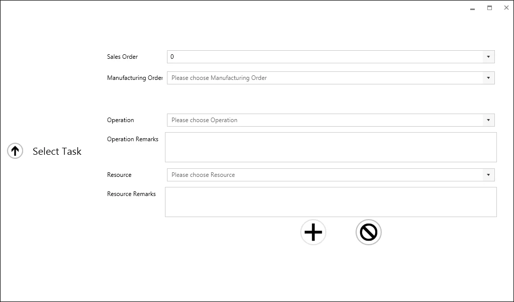
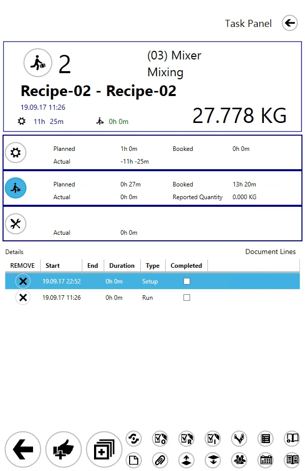
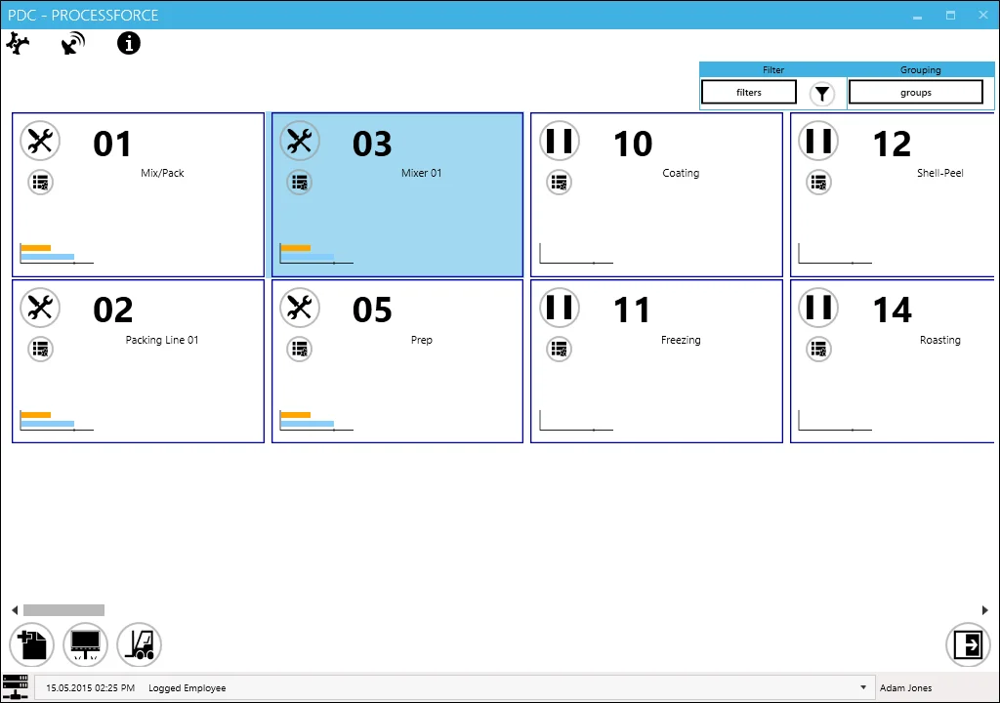

# Introduction to PDC

**Welcome to the CompuTec PDC documentation space.**

PDC stands for Plant Data Capture: the application allows to record production tasks by using ProcessForce Time Bookings documents directly from the production floor.

This is a basic tutorial. You will be installing and starting the application, setting it up, and creating tasks for a specific resource.

Click here to check the introduction video. <!-- TODO: Link -->

## Getting Started

To start working with CompuTec PDC you must:

- download <!-- TODO: Link --> the CompuTec PDC installation file and install it according to the instructions. Be sure to fulfill the requirements
- obtain a license file from CompuTec support and install it via CompuTec License Server. You can check how to do this here
- run the application by clicking its icon on a program list or a shortcut and set it up.
- log in using ProcessForce employee username and password (defined in SAP B1 with ProcessForce: Human Resources > Employee Master Data)
- PDC is ready to work.

### Adding a new task

The main purpose of CompuTecPDC is to register work time (which is performed by creating Time Bookings documents in SAP B1 databases). It is counted for a specific task performed on a specific resource. To start work with CompuTec PDC, click Add New Task icon and set the details of a task.

A form where all details of a new task can be set will appear:

Choosing a specific Manufacturing Order allows choosing among Operations included in it. Choosing an Operation allows choosing a specific Resource to work with. If you will choose Sale Order you can choose from Manufacturing Orders connected to it.

Click the Plus icon after setting all details. For further information, click here. <!-- TODO: Link -->

### Task Panel

<!-- TODO: Link -->

The core of the PDC Work Registration application is a Task Panel, where you can set all values connected to a specific task. You can get to it by clicking a Task tile in the main form (after adding a specific task). To find out more, click here.

### Quantity

The quantity of produced items can be assigned to a specific task by clicking Confirmation Icon on Task Panel after setting the task's times.

CompuTec PDC allows to compare the following values:

- planned quantity – a number of items planned in a specific time working with a specific resource
- actual quantity – a number of items actually produced in a specific time. It can be different from the planned quantity because of downtime, rework or scrap quantity
- rework quantity – a number of items needed to be reworked because of not accepted quality
- scrap quantity – damaged items that can not be reworked

### Time types

Work time for a specific resource in a task can be recorded in three different types:

-  set up time – time of preparation of a resource to work with, e.g. heating an oven to the required temperature
-  run time – time of resource run, during this period Items, can be produced
-  downtime – time of a break of resource run caused by an unexpected event, e.g. downtime caused by a power cut.

You can start and stop to record a specific time by clicking a specific icon on a Task Panel and choosing a specific date and time. Click here <!-- TODO: Link --> for further information.

### Management Board

A user with special privileges can have an insight into planned, booked, or currently performing work on every resource and can assign specific a specific employee to a task. To find out more, click here. <!-- TODO: Link -->

