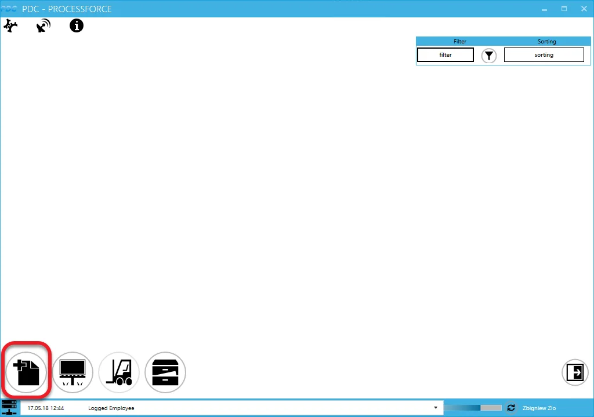
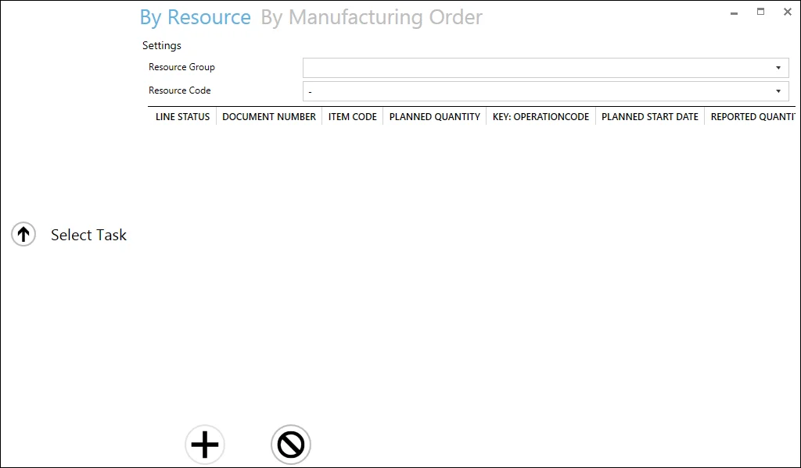
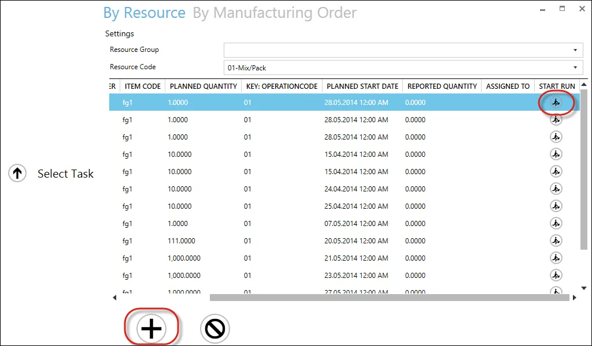
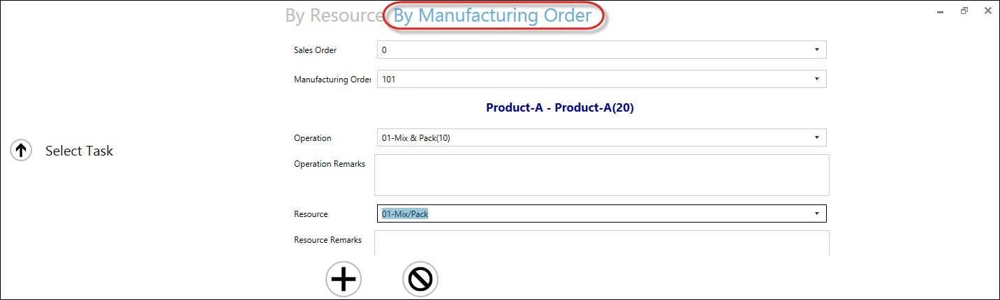
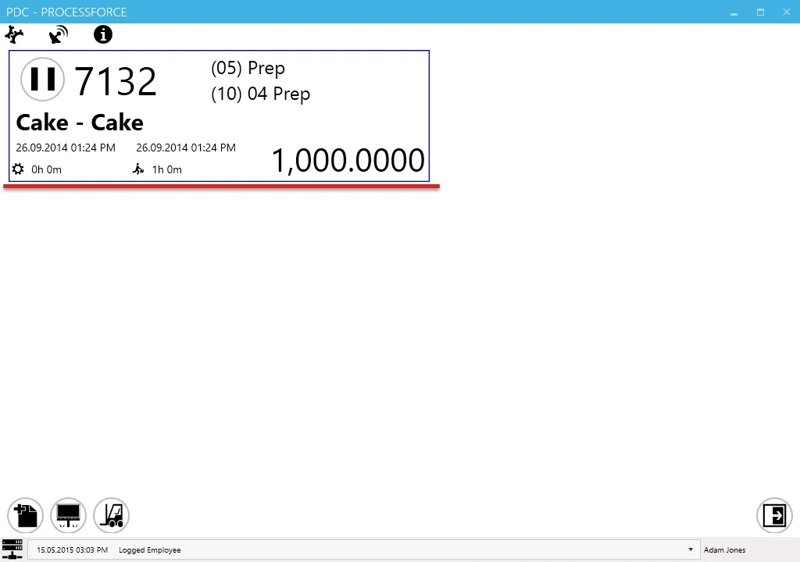
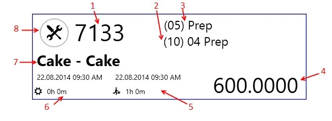

# Adding a new task

A new task can be added to the CompuTec PDC application in three ways:

- by adding a task to the operator through [Management Board](./management-board.md),
- by choosing desired values from the drop-down lists,
- by scanning a barcode assigned to a specific value.

## Adding a new task by choosing desired values from drop-down lists

1. To add a new task click the "task adding" icon in the main form:

    
2. On the top of the form, you can choose between choosing task by Resource or by Manufacturing Order (if a specific resource is set up for a device in [the settings](../administrator-guide/setting-up-the-application/overview.md), only the By Resource card will be available without the search field, only with operations assigned to the specific resource). The following view is for choosing by Resource. To check the workflow for the By Manufacturing Order option, go to point 4 (you can set up the default search method in [the settings](../administrator-guide/setting-up-the-application/overview.md)).
3. Choose Resource from the Resource Code drop-down list. All the tasks related to the specific resource will be displayed on the list. You can filter Resources by choosing a particular Resource Group first.

    

    Task on the list can have one of the following statuses:

     - in progress

     - assigned. A specified task is already assigned to a specific employee (you can check to whom in the Assign to column)

     - task not assigned to any of the employee

     - saved, not closed. You can determine in [the general settings](../administrator-guide/setting-up-the-application/overview.md#processforce-settings) if tasks with this status will be available from the list

    Click the required row and click the + icon or the 'Start Run' icon (Clicking the icon in the Start Run column automatically adds Tasks to the main panel with the status Run) to add the task:

    
4. You can create a Task by using the By Manufacturing Order option:

    

    Choose Manufacturing Order from drop-down lists. If Manufacturing Orders are connected to Sales Order, you can choose them first. It will filter the Manufacturing Orders drop-down list to orders related to a specified Sales Order.
5. Choosing Manufacturing Order filters Operation drop-down list to Operations connected to specified Manufacturing Order.
6. Choosing Operation filters Resource connected to specified Operation.
7. Click the + icon to add the task to the main menu.
8. If the chosen Resource is being used now, an alert about it will be displayed. The Resource can be used anyway. Click "yes" to do that. It will cause a stop of work on the Resource from another document. Resources currently in Downtime are displayed on the list with a note about downtime and are not available to be chosen.
9. The main form appears with the new task tile.

    
10. A task tile displays information about the picked Operation and Resource.

    

    1. Manufacturing Order number.
    2. Operation code, sequence number, and operation name.
    3. Resource code and resource name.
    4. Planned quantity.
    5. Run time start date and period. In the second row (next to the run time icon), a period is displayed.
    6. Setup start date and time. In the second row (next to the set-up time icon), a period is displayed.

        :::warning
            The color of the setup date and time and run date and time may be different:

            - black – planned date and period,
            - green – time type is running currently,
            - blue – time type recorded in CompuTec PDC application (changes the record in a database after clicking the confirmation icon on the confirmation tab).
        :::
    7. Item code and item description.
    8. This icon communicates an operation status:

         - set up time,

         - run time,

         - downtime,

         - the task is paused.

        Clicking it leads to a task panel where you can set details of a specific task.
11. Click the status icon to set periods for specific tasks. For more information, click [here](./task-activities/overview.md).
