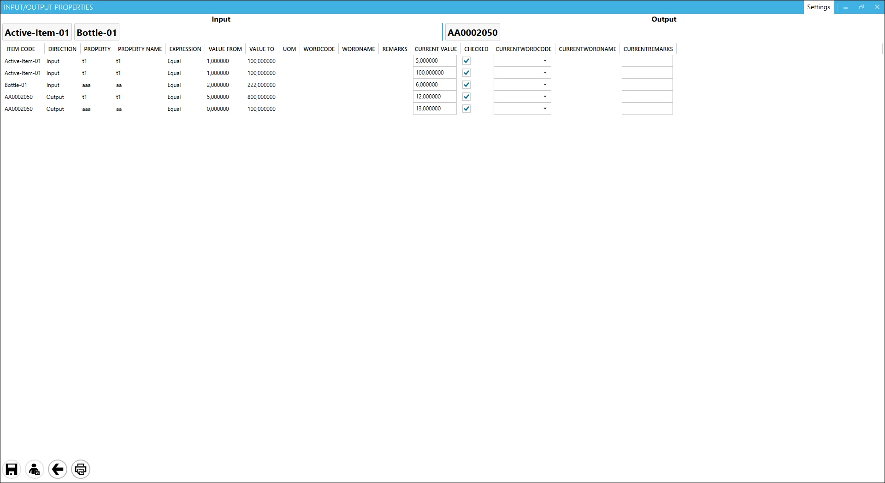

# Input/Output Properties

This option lets you check information saved in the ProcessForce form: Manufacturing Order Operation Bind > Properties tab. It also allows comparing (and saving) actual values against saved ones.

