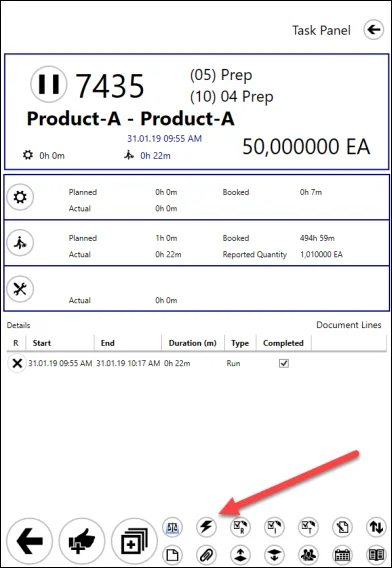
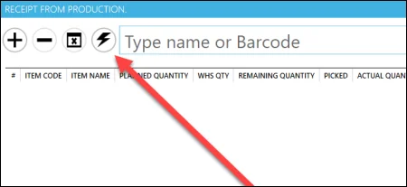
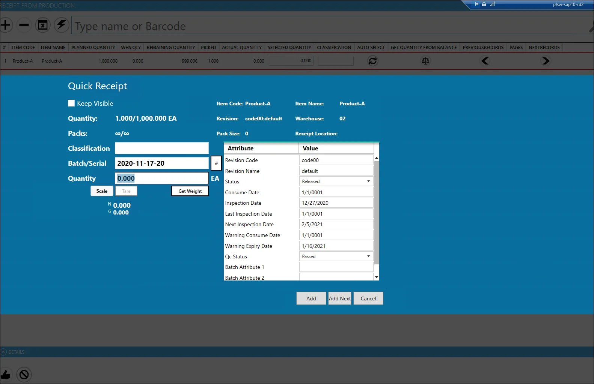
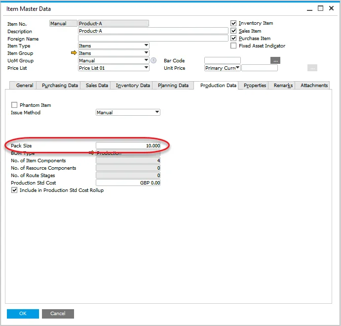
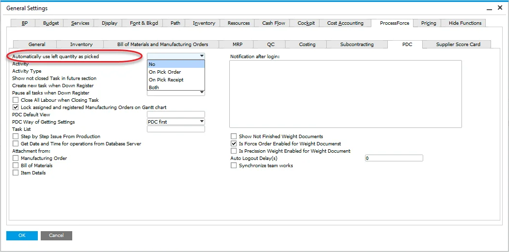
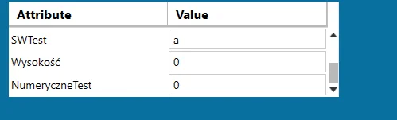
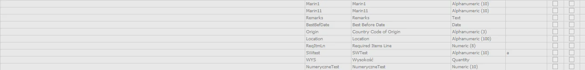

# Quick Receipt

The quick Receipt option is used to receive Final Goods from production for a specific Manufacturing Order. This option speeds up the process by allowing you to set up all the details on one panel.

---

## Access

There are two ways to get to the Quick Receipt panel:

- from a Task Tile level (the button is not available by default; it is required to assign in by using the Customization option):

    
- from Receipt from Production window:

    

## Usage

- Keep Visible checkbox – if checked, the Quick Receipt window stays open after adding a Receipt
- Packs – a number of packs for a current and overall quantity
- Pack Size – defines quantity for a single pack.

    
- '#' button – generation of a first Batch number (another Batch numbers are generated by clicking the 'Add Next' button)
- Quantity field – quantity for a current Batch. It can be automatically filled in based on related ProcessForce setting:

    

    If this option is set to 'No' or 'On Pick Order,' the Quantity field will be set to a value from the Pack Size field (unless the remaining quantity is smaller than the Pack size quantity. In this case, the value will be set to 0). If 'Both' or 'On Pick Receipt' is chosen, the Quantity field will remain Quantity.
- The attribute table allows defining attribute values for a receipt document (based on User-Defined Fields):
    

    

    
