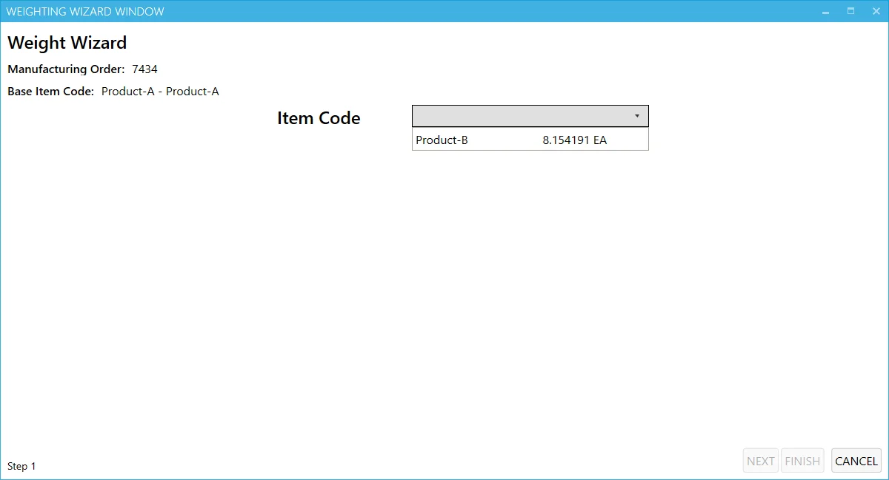
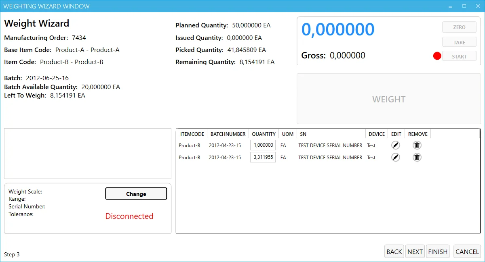
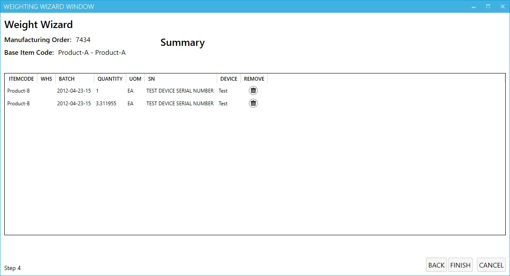

# Overview

The weight scale module supports Issue to Production based on weight documents by integrating weight scaling devices.

Clicking the options icon opens the Weighting Wizard that creates a weight-based Issue to Production by a number of steps.

The icon coloring indicates an approximate level of completion of the issue to production. The white icon indicates a 0% level and is gradually filled with color throughout the process of issuing materials.

---

:::caution
    It is required to configure the connection to a weighing device before starting work with this module. You can check how to do this [here](../../../../administrator-guide/weight-scales-integration/overview.md).
:::

## Step 1: Choosing an Item

This step displays information about the Manufacturing Order number and its final good Item. Also, we choose here which item will be issued for production in this process. An Item row from a drop-down list also shows the quantity still to be issued.

**Note**: Only Batch-managed Items are currently supported in the PDC weighting module.

Click Next after choosing an Item.

## Step 2: Quantity window

In this window, apart from the information from the previous step, we can also see the following quantities:

- Planned (Manufacturing Order's planned quantity),
- Issued (already issued on other Issues to Production),
- Picked (the quantity that already is on Pick Orders but is not published yet).

In this window, the Batch from which items of a particular quantity can be selected is mentioned (for Batch-managed Items). The color of a specific Batch indicates its availability (according to Batch status). If a particular Batch is not in a Released status, a user must confirm that the Batch is to be chosen anyway (dialog box).

Click Next after choosing a Batch.

## Step 3: Weighing

The upper left panel of the window holds information from the previous steps + the quantity available in this Batch, and the quantity still to be weighed.

The lower left panel holds information on a weighing device: a device is connected automatically by clicking Change and choosing one of the defined devices.

The lower right panel holds information on previous issues in this weigh document. This section is visible and editable only to users with Management Board privileges. A regular user can see the panel but cannot modify it.

The upper right panel holds information from a specific weighing device:

- Zero – zeroing the scale
- Tare – weighing a container first and excluding its weight from the final weight
- Start/Stop – beginning and ending weighing
- the result of weighing
- Gross – (if the Tare option is used) combine the weight of the container and material.

It is impossible to save weighed value if it exceeds the Remaining Quantity. It also changes its color to red in this case.

Batch Available Quantity turns red if the weighed quantity exceeds its value.

Click the Weight button to save the weighted value.

## Step 4: Summary

In this window, a summary of the whole process. Click Finish to record an Issue to Production.

