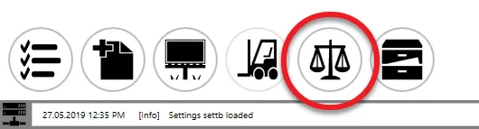
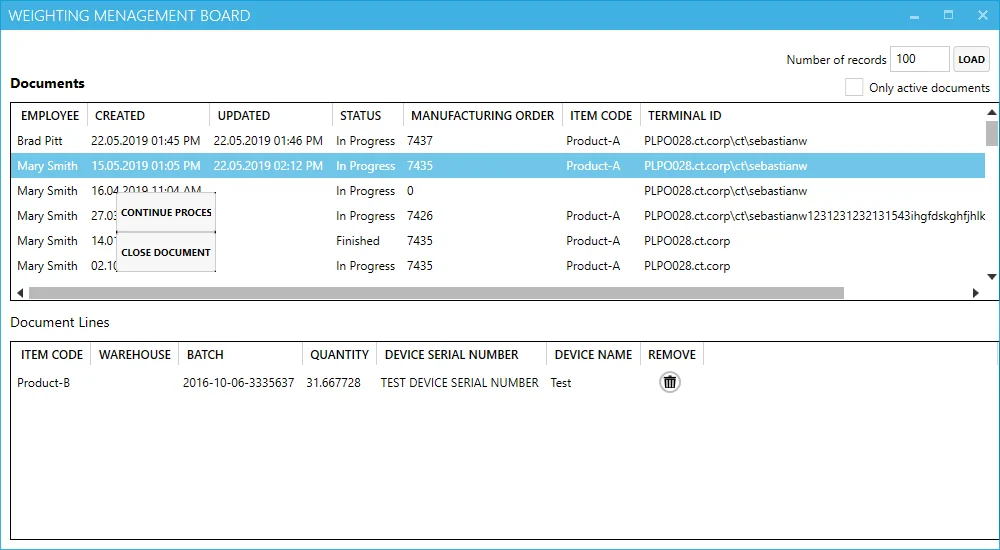

# Weight Management Board

This option allows to manage of all weight documents in the system.

:::note
    Remember that only users with [Management Board privileges](../../../../administrator-guide/setting-up-the-application/overview.md) can use this option.
:::

## Opening

The option is available from the main window of the application:

## Weighting Management Board

### Header

You can define the number of rows in the Documents table.

Checking the 'Only active documents' checkbox filters the Documents table and leaves only documents in 'In Progress' status.

### Documents table

In this table, all weight documents are available. Right-click on a specific line opens a context menu (work only for the document in 'In Progress' status):

**Continue Process** – opens [Weighting Wizard](./overview.md) for this document

**Close Documen**t – closes this document

### Document Lines

In this table, the Document Lines (Items) of a document chosen in the Document table are displayed. Here user can remove a specific line or lines from the document.
