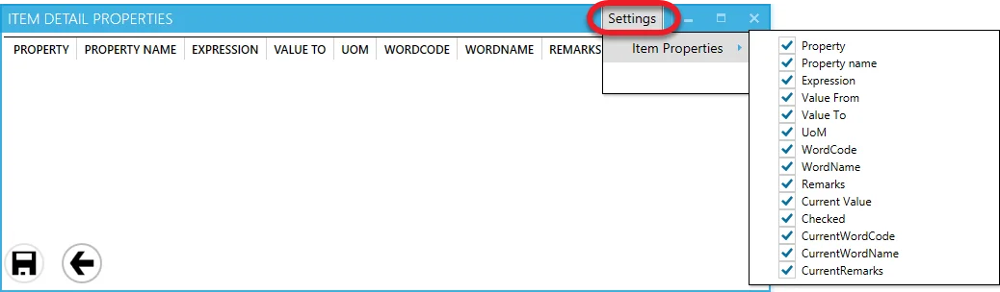
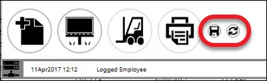
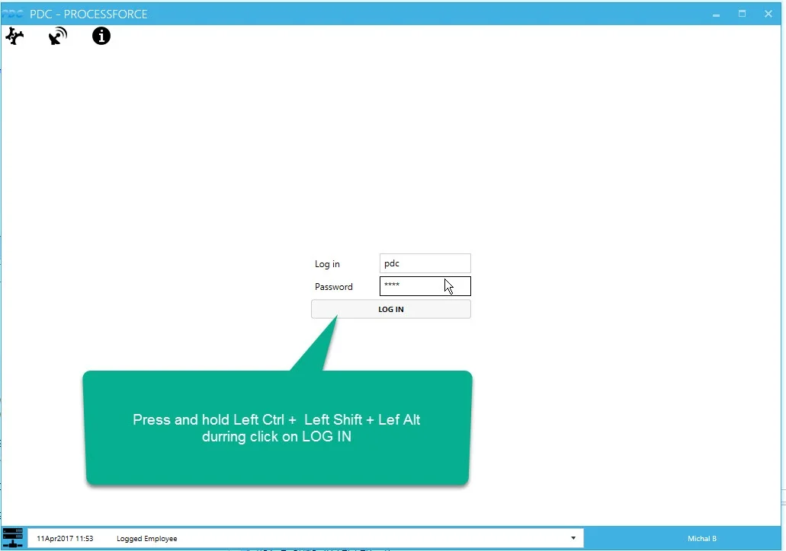

# Overview

CompuTec PDC is an elastic tool that can be customized to meet specific requirements.

---

There are two main ways to customize CompuTec PDC: Form Settings and Task Tile and Task Panel Customization.

## Form Settings

:::info
    To use this option, It is required to activate it for a specific Employee on Employee Master Data. Click here to check how to do this.
:::

Thanks to this option, you can choose which columns are displayed on the following CompuTec PDC forms:

- Task Panel:

  - Details section,
  - Operation Bind,
  - Operation Properties,
  - Resource Properties,
  - Item Details
  - Tools,
- Select Task – By Resource tab.

The option is available from the name bar of the mentioned forms. You can choose which columns are displayed on the form by checking/unchecking the check boxes of specific columns.



## Task Tile and Task Panel Customization

Click and hold the left Shift + Ctrl + Alt keys and click the Log In on-screen button on the log-in screen to activate the Task Tile and Task Panel customization options.

After this, you can choose what values will be displayed in different places on the tile represented by the Change icon: . Uncheck Default check box and choose desired value from a drop-down list. Check the Default check box to get back to the default value:


The customization option works in the same manner on the Task Panel form:


Note that also icons in the lower part of a tile are customizable: you can rearrange them by assigning to them other actions that they actually have.

You can hide one or more buttons by unchecking the Default an IsVisible checkboxes.

A Quick Receipt is an option available from the Receipt from the Production panel. You can choose the option from a drop-down list for a required button. Additionally, it is possible to assign the Quick Receipt action to any of the buttons.

Click the save icon (the left one on the screenshot below) to save the setup values, and click the rollback icon (the right one on the screenshot) to get back to the default values:



### Default View

You can use SQL views option to add other values to drop-down lists. To do this, define the view in a database and enter its name in the PDC Default View field in ProcessForce.

:::info Path
    Administration → System Initialization → General Settings → ProcessForce → PDC
:::


#### Example

**PDC Default View** = PDCVIEW for custom SQL View:

```sql title="MS SQL Example"
Create View [dbo].[PDCVIEW]
as
Select "DocEntry" ,"U_LineNum", U_RscCode+' | '+ U_RscType as "Description" from [@CT_PF_MOR16]
GO
```

```sql title="HANA Example"
Create View "PDCVIEW"
as
Select "DocEntry" ,"U_LineNum", "U_RscCode", "U_RscType" as "Description" from "@CT_PF_MOR16"
```




