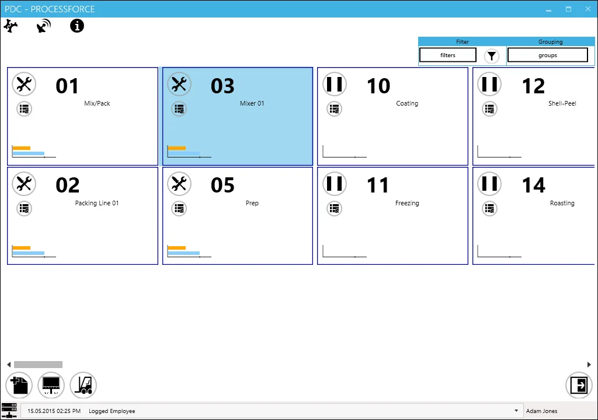

# Management Board

Management Board is a CompuTec PDC function that allows managing work performed on any resource in a system. A straightforward graphic interface provides an easy and quick insight into past, current, and planned tasks, stating details like planned and actual work time or employee assigned to perform a specific work.

:::warning
    To have access to the Management Board function, a specific privilege must be assigned to an operating employee. You can check how to do that [below](#setting-management-board-privilege).
:::

## Setting Management Board privilege

To have access to the Management Board function, a specific privilege must be assigned to an operating employee. Click [here](../administrator-guide/setting-up-the-application/overview.md#requirements) to find out more.

## Management Board main form

Click a specific icon in the main form of PDC to open Management Board.

The main form of the Management Board will open. All available resources are displayed in the form of graphic representation – tiles.

There are two options for resource display: Filter and Grouping.

### Filter

You can filter available records based on specific values.

To use this option, click the Settings button next to the filter button (marked by a red frame on the screen above). The following form will appear:

Choose a required category from the left side of the table and next to a value needed for it from the right side. After choosing the value, its button will be highlighted. Resource category and 02, 03, and 11 values are picked in the screenshot below.

Use icons on the right side of the Filter box to select or deselect all values of a chosen category.

Click the ok button to confirm a selection. Click the filter icon to process with filtering. Now only records with specified attributes will be displayed.

You can filter displayed tasks by:

- Resource,
- Resource group,
- Employee,
- Manufacturing Order,
- Status.

After setting desired values, you can enable or disable filtering by clicking the dedicated value:

### Grouping

You can group available records based on specific values. Records with particular values will be displayed in separate frames.

To use this option, click the Settings button next to the grouping button (marked by the red frame on the screen above). The following form will appear:

After choosing a required value, records will be divided into groups. In the example below, records are separated by status (in this situation: Downtime and inactive tasks).

You can use an icon highlighted in the screenshot below to maximize and minimize a group window.

Tasks can be grouped by:

- Manufacturing Order,
- Employee,
- Resource Group,
- Status.

## Resource Tile

A task tile within Management Board is a graphic representation of a specific task. You have instant, real-time access to any information connected to a particular task with the possibility to modify it.

1. Status icon – icon communicates one of the possible statuses of the task: set up, run, downtime. Clicking it leads to a Task Panel of a specific task. You can find more information about it here.
2. Resource history – clicking it displays the history of use of the specific resource.

    

    Document Status:

     - finished and closed task,

     - task currently active,

     - planned task. It is possible to assign an employee to a task with this status. To do that, click the icon and choose an employee from the list.

    
3. Time graph – a graphic representation of planned and current time:

    

    1. a point of 0% progress, e.g., noon in planned 12:00-14:00 work time,
    2. a point of 100% progress, e.g., 14:00 in planned 12:00-14:00 work time,
    3. a bar of real progress,
    4. a bar of planned progress.

    **Example**:

    An example used on a picture above a bar of planned progress indicates that the end of the scheduled work period has already passed. But a bar of real progress shows that work has stopped halfway through.
4. Resource code.
5. Resource name.
