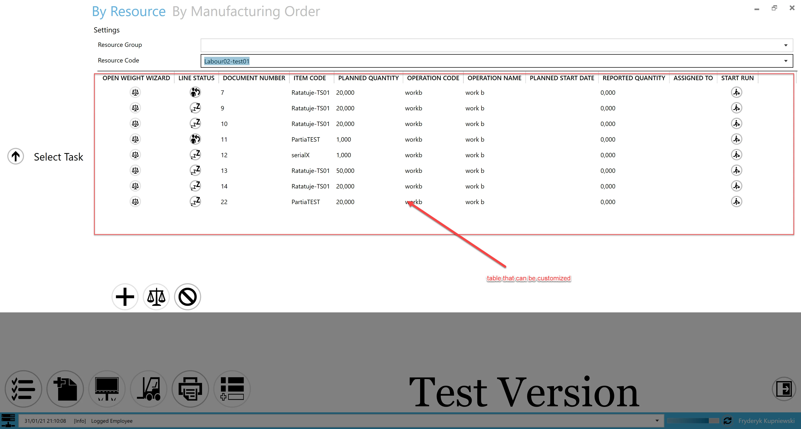
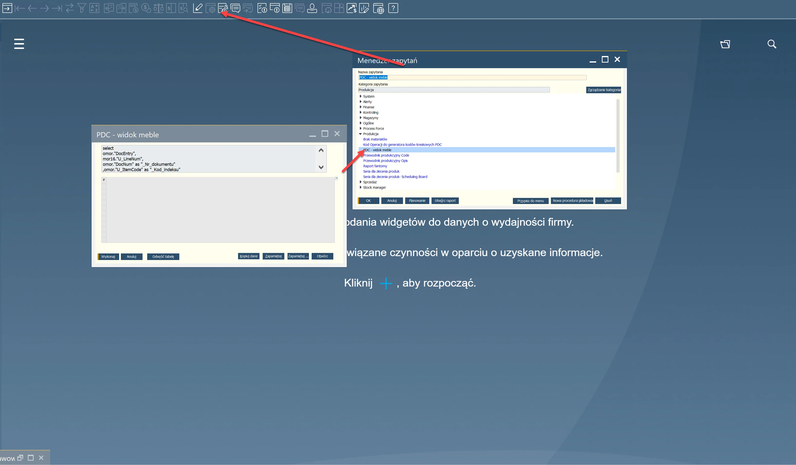
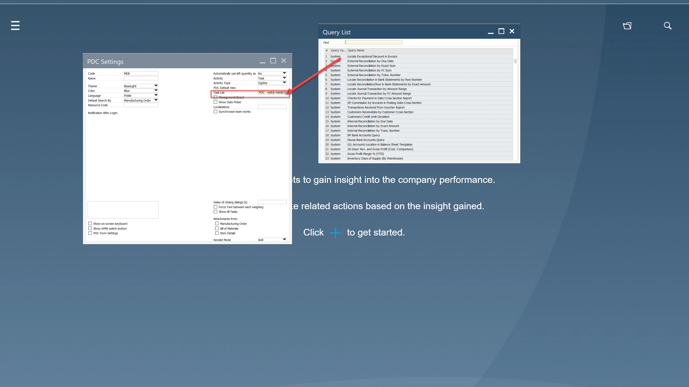
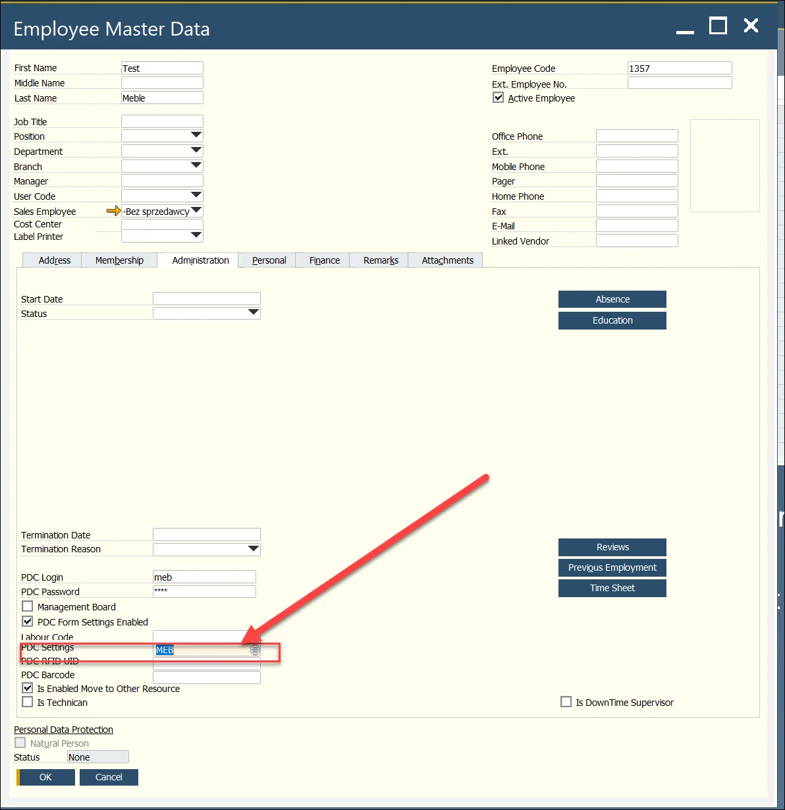
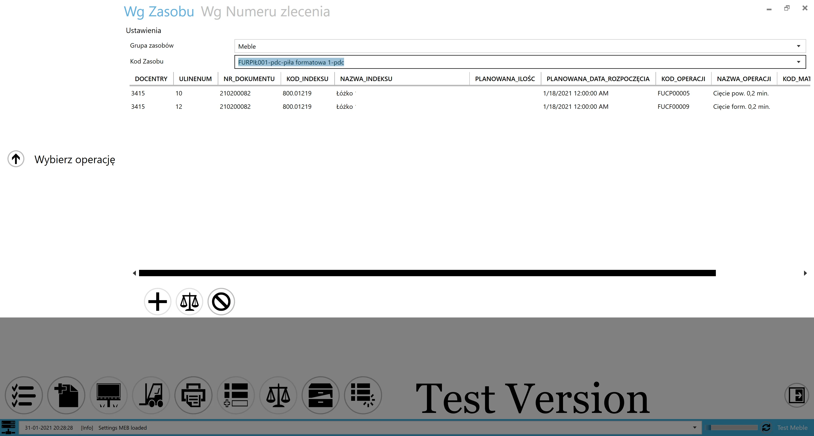

# Customized Task List

This function allows creating a customized table view when adding a task by Resource. This means that based on a few mandatory fields, it is possible to give information from other objects in SAP Business One or ProcessForce by creating an SQL code.

:::caution
    Please note that when using this function, all interactive icons are unavailable.
:::

---



To create a view, perform the following steps:

## Create an SQL code (what columns you would like to display on what conditions, order, etc)

Rules:

- The code has to have a condition written like `where mor16."U_RscCode" =@RscCode`
- The code has to be based on CT_PF tables like `OMOR and/or MOR12 and/or MOR16`
- Columns' aliases need to be written with a floor like `1THWORD_2THWORD`
- `"DocEntry"` and `mor16."U_LineNum"` are always obligatory

```sql title="Example"
select
  omor."DocEntry"
  ,mor16."U_LineNum"
  ,omor."DocNum" as "_Nr_dokumentu"
  ,omor."U_ItemCode" as "_Kod_indeksu"
  ,omor."U_Description" as "_Nazwa_indeksu"
  ,omor."U_Quantity" as "_Planowana_ilośc"
  ,omor."U_PlannedStartDate" "_Planowana_data_rozpoczęcia"
  ,mor12."U_OprCode" as "_Kod_operacji"
  ,opr."U_OprName" as "_Nazwa_operacji"
  ,mor14."U_ItemCode" as "_Kod_materiału"
  ,oitm."ItemName" as "_Nazwa_materiału"
from "@CT_PF_OMOR" omor
inner join "@CT_PF_MOR12" mor12 on omor."DocEntry"=mor12."DocEntry"
inner join "@CT_PF_MOR16" mor16 on omor."DocEntry"=mor16."DocEntry" and mor12."U_RtgOprCode"=mor16."U_RtgOprCode"
left join "@CT_PF_MOR14" mor14 on mor12."DocEntry" = mor14."DocEntry" and mor12."U_RtgOprCode"=mor14."U_RtgOprCode"
inner join "@CT_PF_OOPR" opr on mor12."U_OprCode"=opr."U_OprCode"
left join "OITM" oitm on mor14."U_ItemCode"=oitm."ItemCode"
where mor16."U_RscCode" =@RscCode
  and omor."DocNum" like '21%'
  and mor16."U_Active"='Y'
  and omor."U_Status" in ('ST','RL')
```

## Query Manager

The code needs to be saved in **Query Manager**:



## PDC Settings

It is needed to create a PDC Setting view and select created view/query in the **Task List** field.



## Employee Master Data

The last step to use the customized task list is to assign the created PDC Setting to Employee at Employee Master Data window:



Example of the result in CompuTec PDC:


