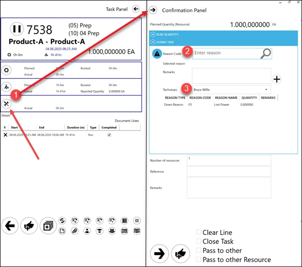
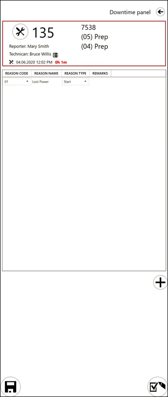

# Downtime

Downtime is a period of a break in work brought on by accident e.g. power cut. Downtime can be registered through CompuTec PDC.

## Downtime related settings

### Employee Master Data

[Technician / Is downtime Supervisor](../../administrator-guide/setting-up-the-application/overview.md)

### General Settings, ProcessForce tab, PDC tab

[Create a new task when Down Register, Pause all tasks when Down Register, Action when Down Register](../../administrator-guide/setting-up-the-application/overview.md#processforce-settings) – these options define additional behaviour during Downtime registration.

## Usage

Reporting Downtime is performed from a Task Tile (1). It is required to set a Downtime Reason (2) and assign a [Technician](../../administrator-guide/setting-up-the-application/overview.md#processforce-settings) (3).

Adding a Downtime creates a Downtime tile available for the [Technician](../../administrator-guide/setting-up-the-application/overview.md#processforce-settings) chosen during creation and to [Supervisors](../../administrator-guide/setting-up-the-application/overview.md#processforce-settings):

The User view:

The Technician and Supervisor view:

The Supervisor can choose another Technician for a Downtime and modify other parameters.
