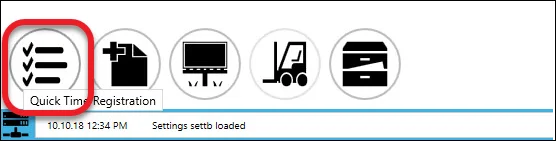
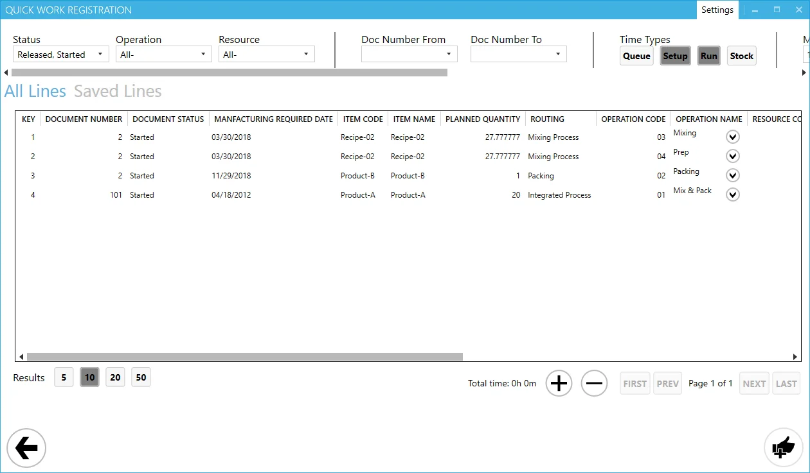

# Quick Time Booking

This function allows to record of the Time Bookings for multiple Manufacturing Orders in one go but settings up all the details in one panel (without the need to create and open separate Task Tiles).

---

The option is available from the main panel:

Clicking the option opens Quick Time Booking panel:

## Header

In the header of the form, you can define filter options to display only required Tasks. The following options are available:

- Status – Manufacturing Order Status; available options: Released, Started, both Released and Started
- Operation – it is possible to choose a specific Operation or all Operations
- Resource – it is possible to choose a specific Resource or all Resources
- Doc Number from and Doc Number to – a range of Manufacturing Order document number
- Time Types – time types of the Tasks. Note that there are also two time types not available from the CompuTec PDC level: Queue and Stock (it is possible to set it up and check from the SAP Business One level)
- Manufacturing Required Date From and Manufacturing Required Date To – a range of Manufacturing Order required date
- Task Start Date from and Task Start Date to – a time range of starting a Task
- Save icon – if you click it after setting up filter options, the option set is saved and will be available on the next opening of the option.
- Restore to default values icon – click to erase ale the changes made to the filters.

## Table section

In this section, all the records defined by the filters option from the header are displayed.

Click the icon next to Operation Name to expand the line to Resources: more than one Resource can be assigned to an Operation. Clicking the icon next to Resource expands this line to Times: for each of the Resources Setup and Run Time can be defined, then quantity, remarks, and [Close Task](./overview.md) option.

Use the Save column checkbox to choose which lines are to be saved eventually. Click Saved Lines to see only lines with the Save checkbox checked.

After setting up all the details and checking the Save checkbox, click the confirmation icon on the lower right corner of the form to record Time Bookings.

## Footer

The footer of the form contains the following display options:

- Results – choose how many records are displayed on one page in the table
- Total time – total duration of all times set for all lines (both set up and run)
- '+'/'-' icon – expands/collapses all line by one level (levels: Operation > Resource > Times)
- Pages – navigating table pages.
