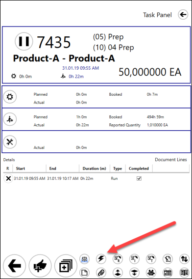
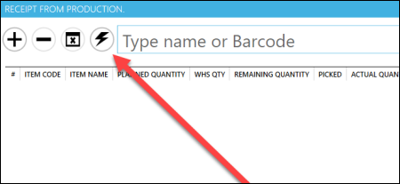
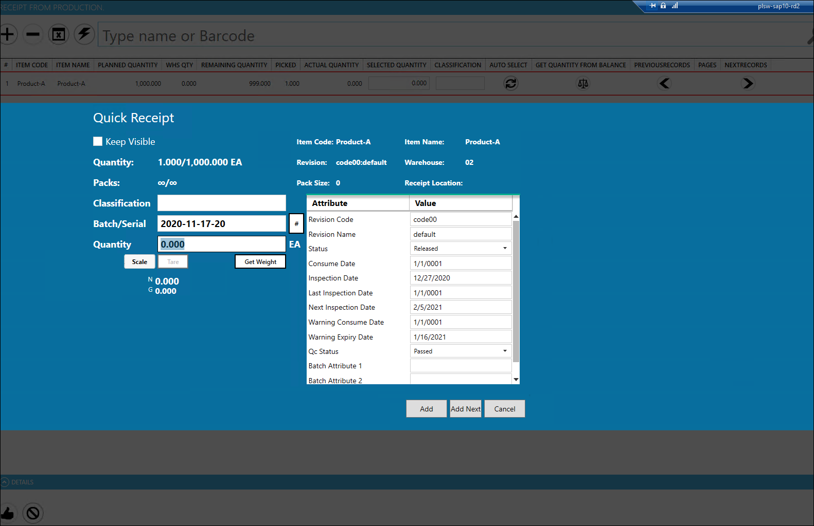

# Quick Receipt

The quick Receipt option is used to receive Final Goods from production for a specific Manufacturing Order. This option speeds up the process by allowing you to set up all the details on one panel.

---

## Access

There are two ways to get to the Quick Receipt panel:

- from a Task Tile level (the button is not available by default; it is required to assign in by using the Customization option):

  

- from Receipt from Production window:

  

## Usage

- Keep Visible checkbox – if checked, the Quick Receipt window stays open after adding a Receipt

- Packs – a number of packs for a current and overall quantity

- Pack Size – defines quantity for a single pack.

