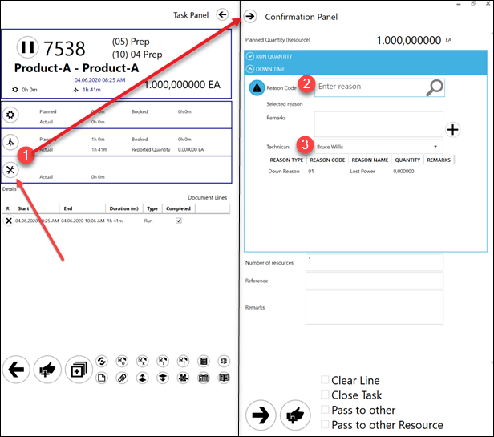
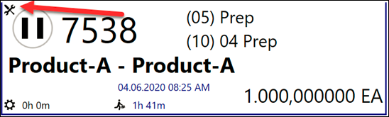
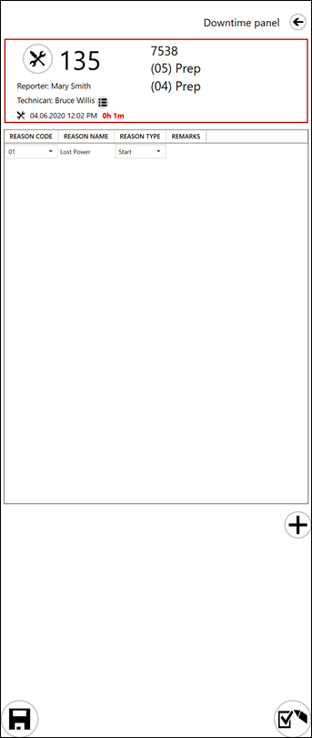

# Downtime

Downtime is a period of a break in work brought on by accident e.g. power cut. Downtime can be registered through CompuTec PDC.

## Downtime related settings

### Employee Master Data

**ADD LINK** Technician / Is downtime Supervisor

### General Settings, ProcessForce tab, PDC tab

**ADD LINK** Create a new task when Down Register, Pause all tasks when Down Register, Action when Down Register – these options define additional behaviour during Downtime registration.

## Usage

Reporting Downtime is performed from a Task Tile (1). It is required to set a Downtime Reason (2) and assign a Technician (3).

Adding a Downtime creates a Downtime tile available for **ADD LINK** the Technician chosen during creation and to Supervisors:

The User view:

The Technician and Supervisor view:

The Supervisor can choose another Technician for a Downtime and modify other parameters.
