# Task Activities

## I. Functionality available within the Task Panel

Clicking a status icon on a task tile in the main form leads to the task panel, where you can find and set details about work periods.

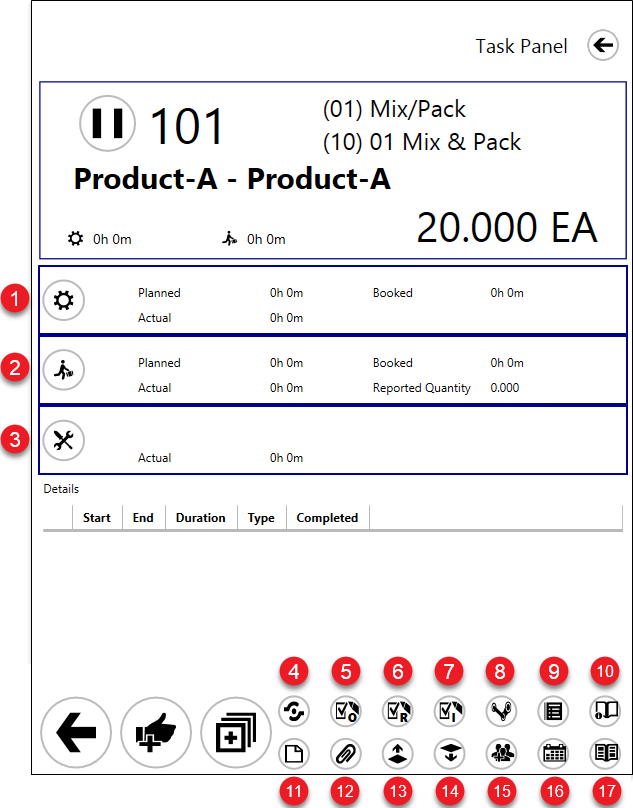

1. Set up time tile.

This tile represents set-up time – a period needed to prepare a Resource before starting production. Planned, actual, and booked set-up duration is displayed. Click the icon on the tile to set the start and end times of the set-up time.
2. Run time tile.

This tile represents run time – a work period on a specific Resource. Click the icon on the tile to set the start and end times of the run time. Planned, actual, and booked run duration is displayed. The reported quantity is also shown.
3. Downtime tile.

This tile represents downtime – a period of a break in work brought on by accident, e.g., a power cut. Click the icon on the tile to set the start and end time of the downtime. Click here to find out more.

4. Input/Output Properties.

You can check if any Items are set up as Input or Output for a specific Operation.

  
Click here to open

  
  Defining Input/Output Items:

  :::info Path
  Production → Bill of Materials → Production Process → Operation Bind tab → Bind Operations
  :::
  
  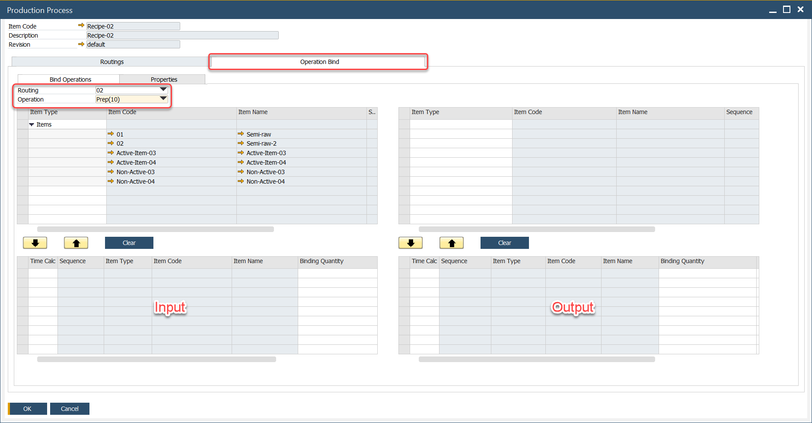

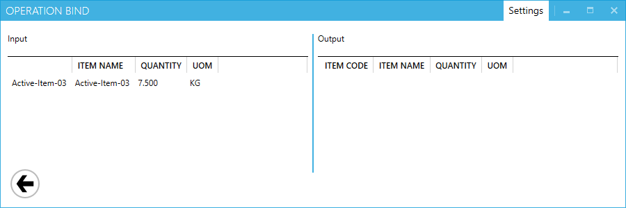

5. Operation Properties.

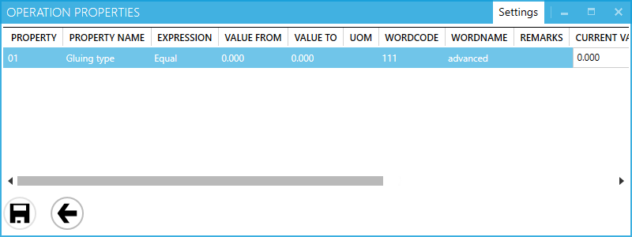

Operation Properties and data connected to it are displayed here. Properties can be defined in SAP B1 with ProcessForce (cannot be defined from CompuTec PDC level) and assigned to Operation or Operation on a specific Manufacturing Order.

Using form settings, you can define which columns (and in what order) are displayed here. Click here to find out more.

Specific Operation Property can have a particular value assigned to it in Manufacturing Order. This value can be numeric (e.,g. more than 10, equal to 10) or word (e.,g. for color: yellow, green, red). In the example below there is value advanced for property Gluing type:

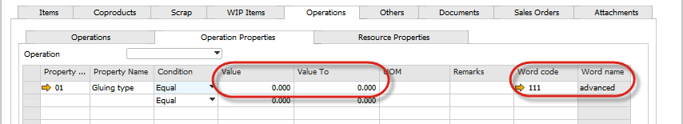

On the property form in CompuTec PDC, you have the values assigned in SAP B1 displayed:

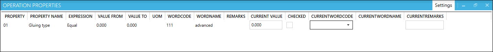

Those are predefined planned values. You can confirm that these are correct on production (by checking the Checked checkbox and clicking the Save icon). You can also change the values if real properties differ from planned ones:

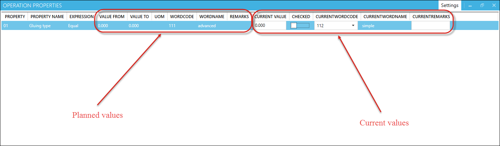

In the example above, current v, values differ from planned: Employee decided to use simple Gluing type instead of a planned advanced one.

To record the set value click the Save icon at the bottom of the Operation Properties form.

Operation properties values recorded from CompuTec PDC level for specific Manufacturing Order Operation can be viewed in SAP B1:

:::info Path
Production → Manufacturing Order → Manufacturing Orders → Operations tab → Operations tab → [Operation context menu]
:::

In the screenshot below, we can see the recorded value from the example above example:

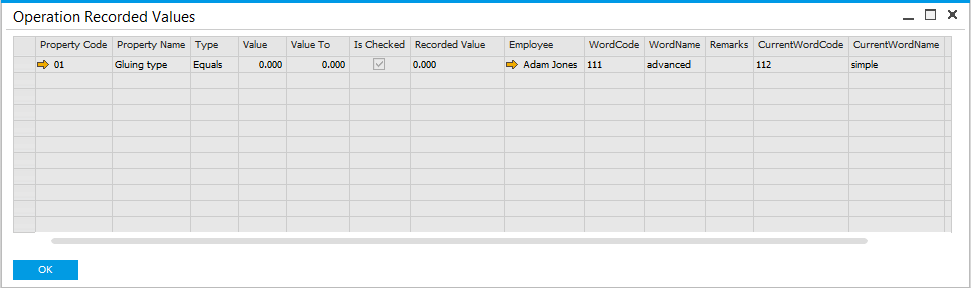

6. Resource Properties.

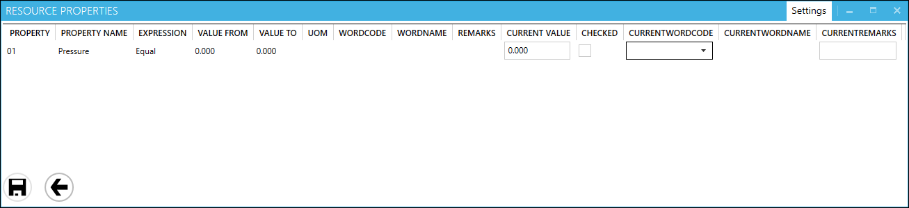

Resource Properties and data connected to them are displayed here. Resource Properties can be defined in SAP B1 with ProcessForce (cannot be defined from CompuTec PDC level) and assigned to Resource or specifically to Resource on specific Manufacturing Order.

You can define which columns (and in what order) are displayed here using form settings. Click here to find out more.

Specific Resource Property can have particular values assigned to it on a  Manufacturing Order. This value can be numeric (e.,g. more than 10, equal to 10) or word (e.g., for pressure: high, low). In the example below, the value High is set up for property Pressure:

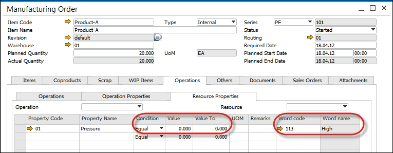

On the Resource Property form in CompuTec PDC, you have the values assigned in SAP B1 displayed:

![Resource Property in PDC]Those are predefined planned values. You can confirm that these are correct on production (by checking the Checked checkbox and clicking the Save icon). You can also change the values if real properties differ from planned ones:

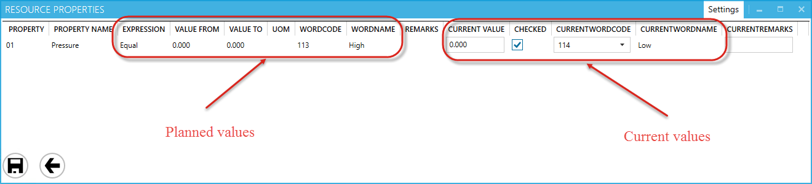

Note that the above example values differ from the planned: The employee used Low pressure instead of High.

To record the set value click the Save icon at the bottom of the Resource Properties form.

Resource properties values recorded from CompuTec PDC level for specific Manufacturing Order Resources can be viewed in SAP B1:

:::info Path
Production → Manufacturing Order → Manufacturing Orders → Operations tab → Operations tab → [Resource context menu] → Properties > Recorded Values for Resource
:::

In the screenshot below, we can see the recorded value from our example:

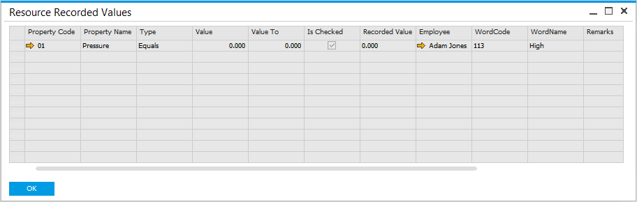

7. Item Details.

Item Details are displayed here.

Current values can be recorded against original values (in a similar way as in Operation Properties or Resource Properties).

You can set the order of the records by desired value (e.g., Property Name).

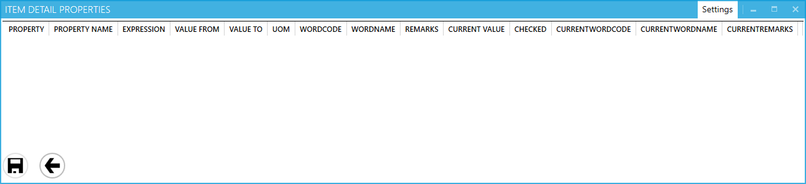

8. Tools

Tools Properties are displayed here. If the specified Resource is connected to a Tool and the Tool has Properties defined, you can check it and confirm it (in the same way as for, e.g., Resource Properties).

You can set the order of the records by desired value (e. g. Tool Name).

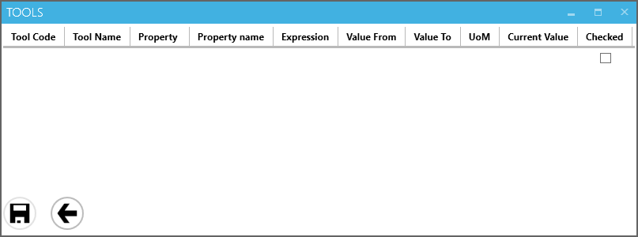

9. Bill of Materials preview.

Displays default printing layout set up for a specific SAP Business One user (logged in to CompuTec PDC). If the user has no default printing layout defined, nothing is displayed after choosing this option.

10. Bill of Materials Instructions.

Here you can find instructions stored in the Bill of Materials → Instruction tab.

11. Manufacturing Order preview.

Displays default printing layout set up for a specific SAP Business One user (logged in to CompuTec PDC). If the user has no default printing layout defined, nothing is displayed after choosing this option.

12. Attachments.

You can see, browse and open Attachments connected to a current Manufacturing Order.

13. Production Issue.

:::caution
This option is active when a specific Resource has a default issue Warehouse (or Warehouse and location if option Enable Bin Locations is checked) defined. (On an attempt to use the option without this setup, a system message on the lack of the settings will be displayed).
:::

Use this option to issue Items to production.

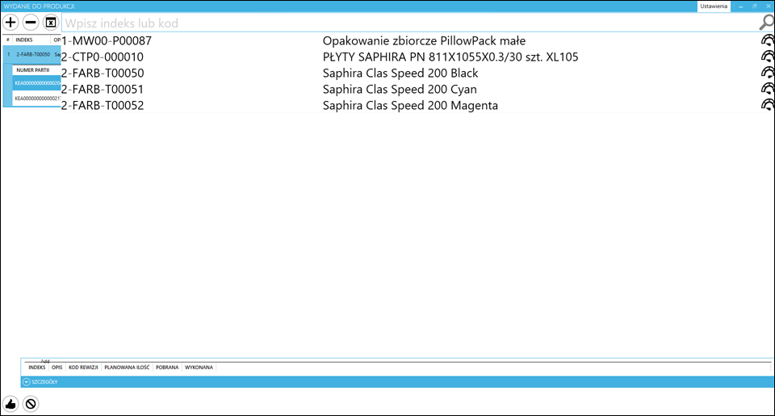

Items needed for production can be chosen from the list. After selecting an Item, a list of all its components will be displayed. You can select all of the said components. If all needed components are available in a warehouse, click the thumb-up icon.

Materials issued to production are automatically subtracted from a warehouse. There is no need to confirm it from CompuTec WMS or SAP B1 level.

14. Production Receipt.

:::caution
This option is active when a specific resource has default receipt Warehouse (or Warehouse and location if option Enable Bin Locations is checked) defined. (On an attempt to use the option without this set up, a system message on the lack of the settings will be displayed).
:::

To perform production receipt, choose produced Item from the list. Click the following icon to generate a batch number.

Click the thumb-up icon to confirm and perform it again in the panel on the right. A message In Progress. Issue from Production will be displayed.

Receipt from production has to be confirmed from SAP B1 level by going to Production → Inventory Transactions → Pick Receipts. Pick the required document, click the right mouse button, and choose Receipt from production.

Check also the Quick Receipt option.

15. Team Log in.

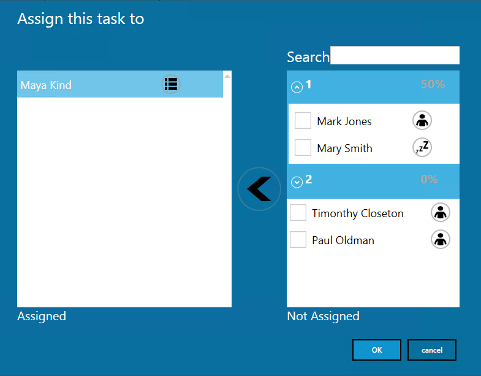

A team leader can choose Employees that are to be assigned to the task. There is no limit for Employees to be assigned to one task.

:::caution
Please note that Employee has to have Labour assigned to be able to be chosen from the list.
:::

Click checkboxes next to required Employees and click an arrow left icon to assign them to a Task.

Next to each of the Employees, there is an icon indicating if an Employee is currently assigned to any Task (a man icon) or not (the sleep icon). Click the icon to display a list of Tasks to which an Employee is assigned.

The option also supports Teams (a standard SAP Business One option that can be set up in Human Resources > Employee Master Data > Membership tab). Each Team is represented by a header containing a Team name (1 and 2 in the example screenshot above). You can display or hide a list of members (up/down icon next to a Team name). A Header also contains a percentage value: it is a percentage of people in the team without any Task assigned.

Click the OK icon after choosing all required Employees (by moving them to the Assigned section).

After choosing Employees by the team leader and accepting the choice, the Task will be set to Run status for every Employee assigned.

Finishing work by a team leader finishes it for every Employee assigned. The Team leader sets up the produced quantity on a Resource on finishing work.

One Time Booking document is created for a Resource and Employees specified on it (instead of creating a Time Booking for each Employee).

Each Employee can finish work independently, e.g. to change Resources or leave work station. Finishing work by Employee does not finish it for others. An employee does not declare quantity on finishing work.

16. Activity.

This is a standard SAP Business One functionality. You can set up an activity (e.g. Conversation, Note) and activity type (e.g. General, Internal) in ProcessForce General Settings. When choosing the Activity option from the CompuTec PDC level an Activity with predefined settings are created. This way, an activity is connected to a specific Manufacturing Order, Operation, Resource (depends on from which Task tile it is created), and Employee (logged in to CompuTec PDC).

17. Technical Instruction.

Here you can find instructions stored in Manufacturing Order → Operations → Instruction tab.

### Additional options

Some of the available options are not present on a Task Tile by default. You can reach them by using the Customization option.

## II. Example.

In this section, you can find a step-by-step guide on setting work time on a task based on a specific example.

1. Adding a new task.

To get information on this, click here.

2. Click a status icon on a task tile to open a task panel of a specific task.

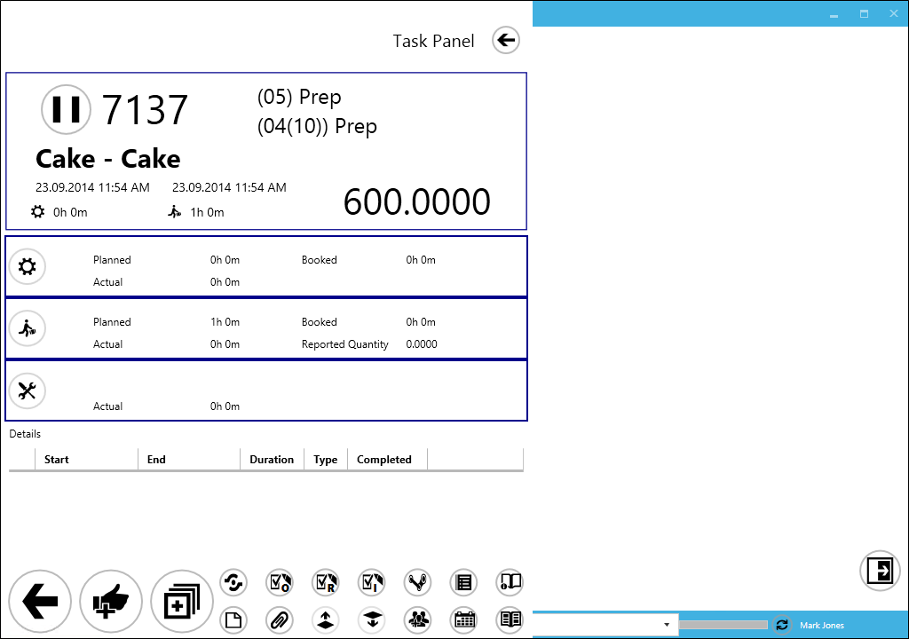

3. Setting set-up time

  a. click the set-up icon on the set-up time tile. You can predefine whether clicking starts counting time from a current moment or leads to setting up the start date and time manually panel (the Show Date Picker option).

  b. the set-up time starts to count. It will be communicated by the set-up time and period turning green, the period changing in real-time, and by the set-up icon on the set-up tile blue highlight.

  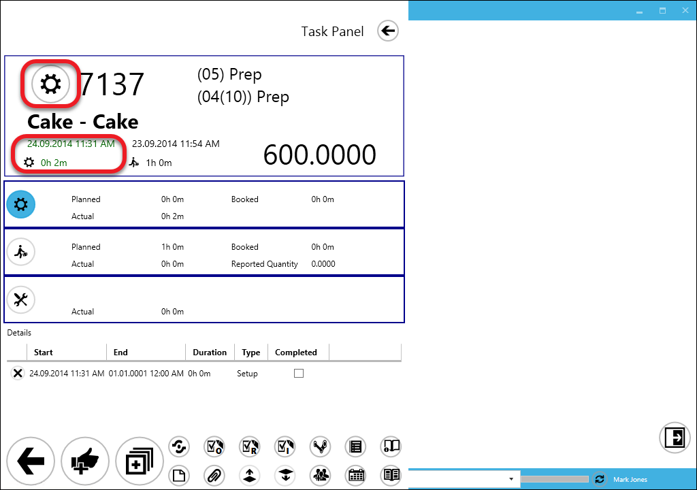

  c. click the set-up icon again to end the set-up time. It may be done after logging out and logging in again. It will cause a stop of time counting which will be communicated by the set-up time and period turning blue.

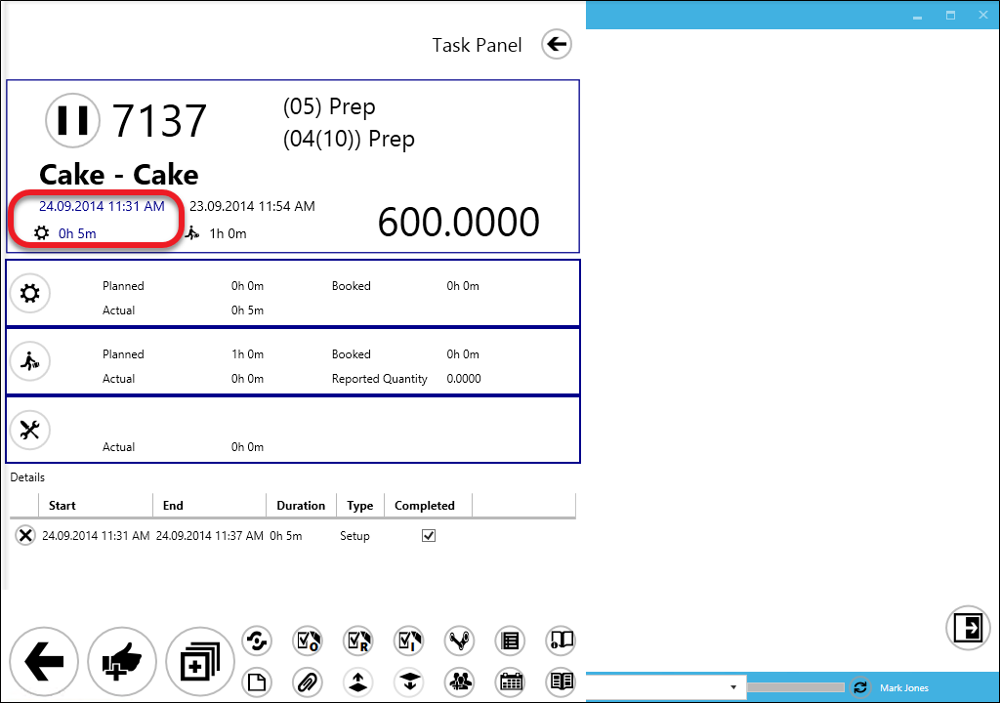

:::caution
Clicking the status icon on a task tile displays (or hide if it is displayed) a log of actions performed on a current task in the CompuTec PDC application. You can delete an activity by clicking the X icon next to it.
:::

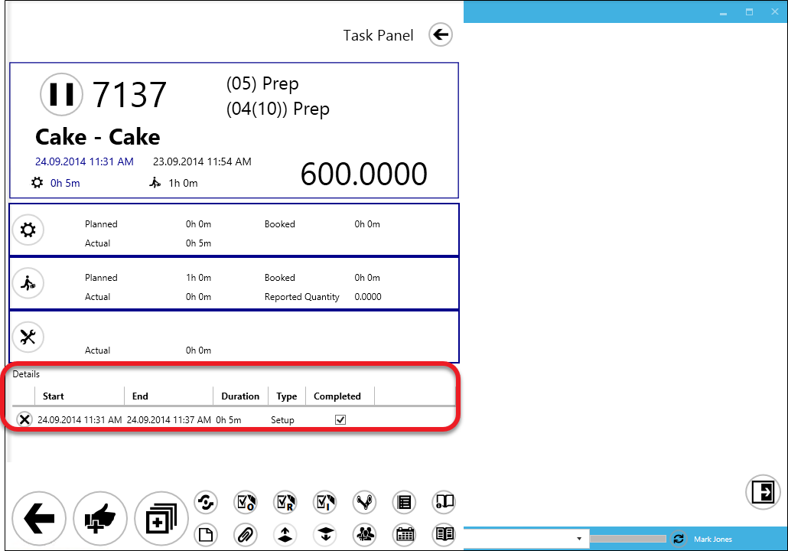

4. Setting run time

Run time setting must be performed the same way setting set-up time was – only using the run time tile.

Set-up time ends automatically after starting a run time.

If the Confirmation button will be clicked before setting the end of run time, a communication will be displayed:

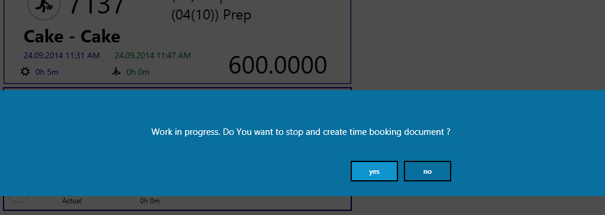

Click the yes button to set the run time's end which leads to Confirmation Panel or the no button to cancel the action.

4. Setting downtime.
Click here to find out more.

5. Confirmation of time periods in a task.

:::warning
All changes in periods are set in the CompuTec PDC application. Changes are posted in a chosen database only after posting a document from the Confirmation panel.
:::

  a. after setting all the periods, click the "complete" icon (the thumb up):

  The Confirmation Panel will appear:

  

  You can register quantity for set up time (if it is needed; this option is available only when set up time has been registered) and quantity for run time (number of Items produced during work time). When the Damaged Quantity field is filled, the Reason Code and Remarks for rework fields will be displayed and ready to fill:

  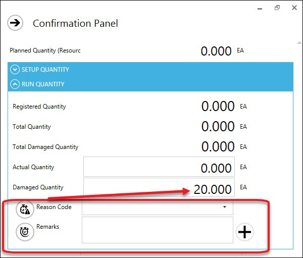

  b. after setting up quantities you can decide to keep the task open after registering work (no check boxes checked), to close the task or to pass it to another employee Select Employee field will be displayed in this case.

  

  Close Task – checking this option causes the following:

  - a task with this option checked is removed from the list of tasks to do – and gets Closed status on a Gantt chart,

  - in Manufacturing Order, Operation tab, the Resource line is grayed out and a value in the Resource column Active is set to N,

  - a Resource for an Operation on which Close Task is used is not available to choose for a new task on CompuTec PDC.

  When all of the Resources in an Operation have Active set to N, the Operation gets Finished status.

  Unblocking a Resource for operation in the Manufacturing Order scope can be done by adding a Timebooking correction document with an unchecked Close Task option.

  Pass to other – this option adds the task to a specified employee. After accepting the task, it is passed to the chosen employee. It has to be started manually from the chosen employee level.

  Pass to other Resource – this option allows to pass a Task to another Resource on registering a Timebooking or downtime. On choosing this option a drop-down list appears with Alternative Resources defined for a current Resource (it is possible to switch the Task only to an Alternative Resource with Machine Type for a current Resource. Click here to find out more about Alternative Resources definition in ProcessForce).

  To be able to pass a Task to another Resource it is required to check Is enabled Move to Other Resource in Employee Master Data.

  Click the confirmation icon to register work.

  c. Number of Resources – in this field, we can define a number of resources of the same kind for which work is to be recorded, e.g. if we have a Resource called Oven, here we can define how many pieces of the same equipment was used, e.g. 5 ovens. By default 1 is put in this field. In case of putting a higher value, recorded duration is the accumulated effort of each of the equipment pieces.

  Example:

  We recorded 48h, and 25s of work and set up the Number of Resources to 5. The effort is multiplied by 5 (work was performed on 5 pieces of equipment simultaneously) which results in 240h, 2m, 5s of accumulated work duration.

  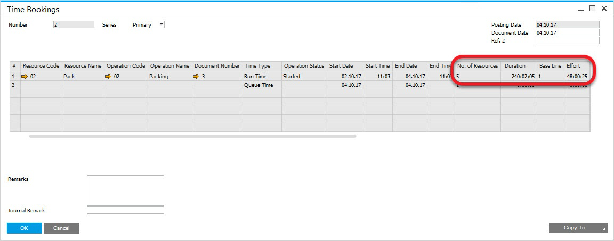

  :::info Path
  Please mind that the Number of Resources field value is set up to 1 by default, regardless of the Number of Resources field value of a corresponding Resource record in ProcessForce.
  :::

  6. Recording quantity without closing a Task.

  You can use the plus icon to record quantity without closing a Task.

  This leads to a panel similar to Confirmation Panel in which it is possible to enter required quantities. Doing so updates Reported Quantity on Task Panel. A Task is still open and active after doing so.